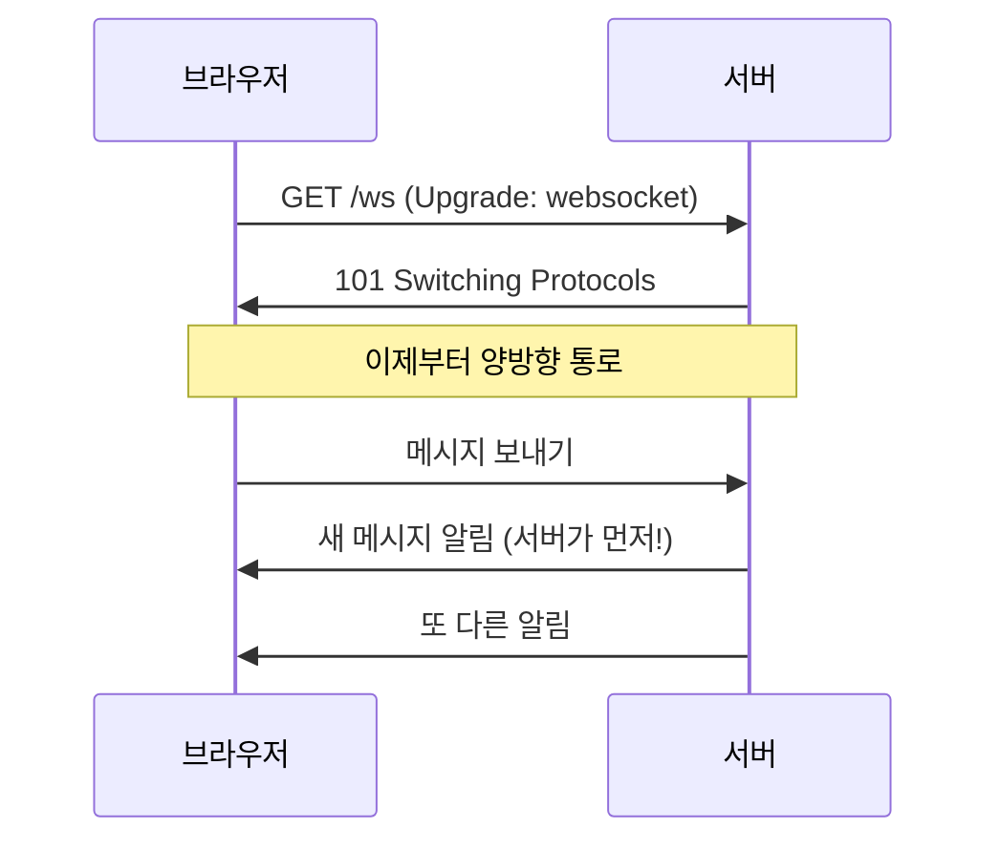
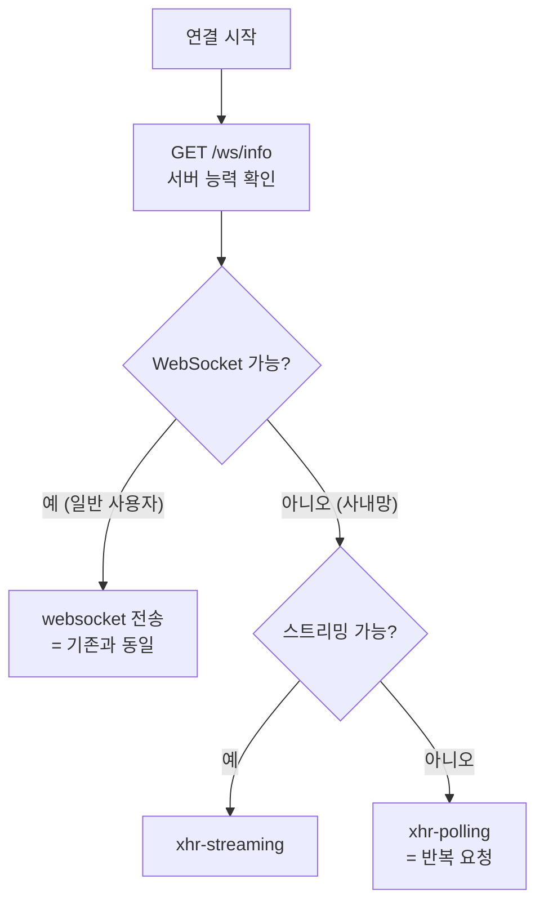
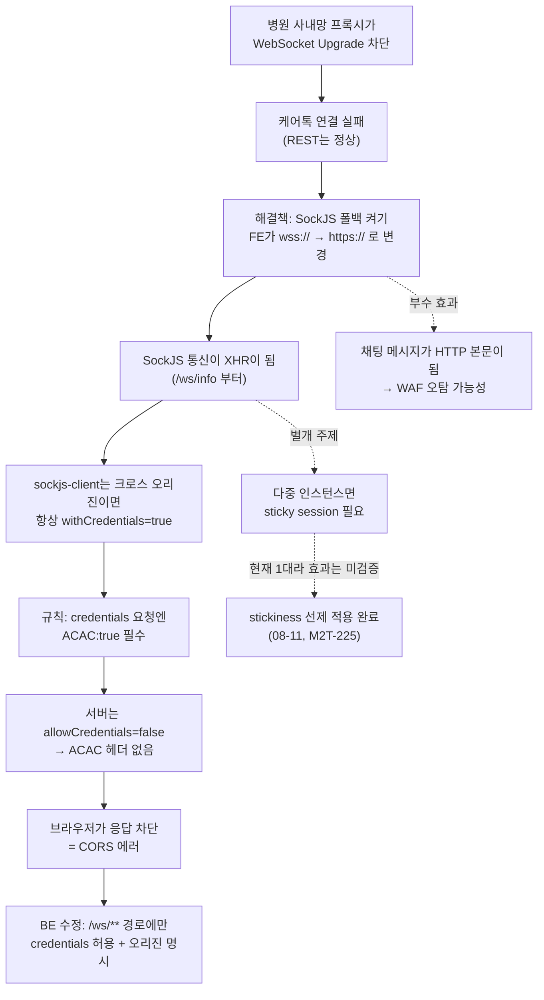

# 케어톡 사내망 이슈로 배우는 웹 실시간 통신 · CORS · 인프라 개념 정리

> M2T-222 / M2T-221 조사 과정에서 나온 개념들을 배경 지식 없이도 읽을 수 있게 정리한 학습 문서.
> 계기: 회사 업무(M2T-222/221) 조사 — 구현 계획 문서는 회사 레포에 있음.
> 작성일: 2026-08-04

---

## 0. 이번 사건 한 문단 요약

병원(고객사) 사내망 PC에서 파트너스 웹에 로그인은 되는데 **케어톡(실시간 채팅)만** "연결 끊김"이 뜬다. 개인 노트북에서는 정상이다. 원인 추정은 **사내망 프록시가 WebSocket 연결을 차단**하는 것. 해결책은 WebSocket이 막히면 평범한 HTTP 요청으로 우회하는 **SockJS 폴백**을 켜는 것인데, 그걸 켜자마자 이번엔 **CORS 에러**가 나면서 막혔다. 그래서 백엔드가 CORS 설정을 고쳐야 하는 상황이다.

이 문장 안에 모르는 단어가 하나라도 있으면 이 문서가 도움이 된다. 아래 순서대로 읽으면 위 문단이 전부 이해된다.

---

## 1. 내가 물어본 것들 → 어디를 보면 되나

| 질문 | 섹션 |
|---|---|
| 소켓 통신의 기본 개념이 뭔가 | [2 HTTP의 한계](#2-먼저-http부터--왜-실시간-통신이-어려운가), [3 WebSocket](#3-websocket--한-번-연결해두고-계속-쓰는-방식) |
| 폴백 연결은 뭐가 어떻게 다른가 | [6 SockJS와 폴백 사다리](#6-sockjs--websocket이-막히면-http로-흉내내기) |
| SockJS XHR이 뭔가 | [6.3 XHR이란](#63-xhr이-뭔가) |
| CORS가 뭔가 | [7 CORS](#7-cors--브라우저가-남의-집-응답을-못-읽게-막는-규칙) |
| ACAO 같은 헤더들은 뭔가 | [7.5 CORS 헤더 사전](#75-cors-헤더-사전-외울-필요는-없고-찾아보면-된다) |
| 왜 wss는 되는데 SockJS는 CORS에 걸리나 | [7.8 WebSocket과 CORS](#78-왜-네이티브-websocket은-cors에-안-걸리나) |
| sticky session / ALB는 뭔가 | [9 로드밸런서와 세션 고정](#9-로드밸런서와-세션-고정sticky-session) |
| WAF가 뭔가 | [10 WAF](#10-waf--웹-방화벽) |
| 결국 이번 건 전체 인과관계는 | [11 전체 흐름](#11-이번-사건-전체-인과-정리) |
| HTTP는 응답이 끝나면 연결을 닫는 것 아닌가 | [부록 A.1 keep-alive](#a1-http는-응답이-끝나면-연결을-닫는다) |
| 소켓 하나를 재사용한다는 게 무슨 뜻인가 | [부록 A.2 소켓과 프레이밍](#a2-소켓-하나로-요청을-여러-번-주고받는다는-게-무슨-뜻인가) |
| 연결을 닫는다는 게 정확히 무슨 일인가 | [부록 A.3 4-way와 TIME_WAIT](#a3-연결을-닫는다는-것--4-way-half-close-time_wait) |
| TCP 상태는 커널에 있다는데 앱은 뭘 보나 | [부록 A.4 커널과 앱의 경계](#a4-그-상태는-누가-들고-있고-앱은-무엇을-보는가) |
| 프록시는 뭘 보고 뭘 끊나 | [부록 A.5 프록시 절단의 해부](#a5-프록시-절단의-해부--무엇이-어디서-끊기고-어떻게-감지되나) |
| 브라우저는 응답을 언제까지 기다리나, 타임아웃이란 뭔가 | [부록 A.6 실패 판정의 원리](#a6-브라우저는-응답을-언제까지-기다리고-실패를-무엇으로-판정하나) |

---

## 2. 먼저 HTTP부터 — 왜 실시간 통신이 어려운가

### 2.1 HTTP는 "질문하면 답한다"가 전부

우리가 쓰는 웹의 기본 통신 규약은 **HTTP**다. 핵심 성질은 딱 하나다.

> **클라이언트가 요청해야만, 서버가 응답한다.**

```
브라우저 ──── "회원 목록 주세요" (GET /api/v1/members) ───▶ 서버
브라우저 ◀─── "여기 있습니다" (200 OK + JSON) ──────────── 서버
                   [요청-응답 한 턴 끝]
```

응답을 주고 나면 대화는 끝난다. 다음에 뭔가 필요하면 브라우저가 **또 물어봐야** 한다. 서버가 먼저 "야, 새 메시지 왔어"라고 말할 방법이 원칙적으로 없다.

이걸 **요청-응답(request-response) 모델**이라고 한다. 게시판, 상세 조회, 저장 버튼 같은 기능엔 완벽하다. 사용자가 행동할 때만 통신하면 되니까.

> **주의:** 위 그림의 "한 턴 끝"은 **대화가 끝났다**는 뜻이지 **TCP 연결이 닫힌다**는 뜻이 아니다. HTTP/1.1부터는 연결 유지(keep-alive)가 기본이다. 다만 연결이 열려 있어도 서버가 먼저 말을 걸 수 없다는 점은 그대로라, 아래 2.2의 문제는 해결되지 않는다. → [부록 A.1](#a1-http는-응답이-끝나면-연결을-닫는다)

### 2.2 채팅에서 문제가 생긴다

채팅은 반대다. **상대방이 메시지를 보내는 순간** 내 화면에 떠야 한다. 그런데 내 브라우저는 상대가 언제 보낼지 모른다. HTTP만으로 이걸 흉내 내려면 이런 방법들을 쓴다.

| 방식 | 동작 | 문제 |
|---|---|---|
| **폴링(polling)** | 3초마다 "새 메시지 있어요?" 물어봄 | 대부분 "없다"는 답. 낭비가 크고 최대 3초 지연 |
| **롱 폴링(long polling)** | 물어보고 **서버가 답을 안 하고 기다림**. 메시지가 생기면 그때 응답 | 낭비는 줄지만 메시지 하나 받을 때마다 요청을 새로 보내야 함 |
| **스트리밍** | 응답을 끝내지 않고 조금씩 계속 흘려보냄 | 서버→클라이언트 한 방향만 가능 |

전부 "HTTP로 억지로 흉내내기"다. 그래서 아예 **양방향 통신용 규약**이 따로 만들어졌다. 그게 WebSocket이다.

> 참고로 **이 "억지로 흉내내기" 방식들이 나중에 폴백(fallback)으로 다시 등장한다.** WebSocket이 막힌 환경에서 쓸 수 있는 게 결국 이것들뿐이기 때문이다. (6장에서 다룬다)

---

## 3. WebSocket — 한 번 연결해두고 계속 쓰는 방식

### 3.1 개념

**WebSocket**은 브라우저와 서버 사이에 **끊기지 않는 통로**를 하나 열어두고, 양쪽 누구든 아무 때나 데이터를 보낼 수 있게 하는 통신 규약이다.

- HTTP: **편지**. 보낼 때마다 봉투에 넣고 주소 쓰고 보낸다. 답장이 와야 대화가 이어진다.
- WebSocket: **전화**. 한 번 연결하면 끊을 때까지 양쪽이 자유롭게 말한다.

"소켓 통신"이라는 표현은 원래 OS 레벨의 TCP 소켓 프로그래밍을 가리키지만, 웹 개발에서 "소켓"이라고 하면 보통 이 WebSocket을 뜻한다.

### 3.2 연결 방법 — HTTP로 시작해서 승격(Upgrade)한다

여기가 이번 사건의 핵심이다. WebSocket은 **처음엔 평범한 HTTP 요청으로 시작**한다.

```http
GET /ws HTTP/1.1
Host: partners-api.mora-care.kr
Upgrade: websocket            ← "이 연결을 WebSocket으로 바꿔주세요"
Connection: Upgrade
Sec-WebSocket-Key: dGhlIHNhbXBsZSBub25jZQ==
Sec-WebSocket-Version: 13
Origin: https://partners.mora-care.kr
```

각 줄의 의미는 이렇다.

| 줄 | 의미 |
|---|---|
| `GET /ws HTTP/1.1` | 평범한 HTTP GET 요청이다. WebSocket 전용 문법이 아니다 — 그래서 방화벽·프록시 눈에도 일단은 보통 요청으로 보인다 |
| `Host` | 접속할 서버 도메인. 한 IP에 여러 도메인이 얹혀 있을 수 있어 필수다 |
| `Upgrade: websocket` | **핵심 헤더.** "이 연결을 WebSocket으로 바꿔달라"는 요청 |
| `Connection: Upgrade` | 위 `Upgrade` 헤더를 실제로 처리하라는 지시. 이 둘은 항상 한 쌍으로 움직인다. **사내망 프록시가 걸러내는 지점이 보통 여기다** |
| `Sec-WebSocket-Key` | 클라이언트가 만든 무작위 16바이트를 Base64로 인코딩한 값. 암호화·인증용이 **아니고**, 중간 캐시 장비가 예전 응답을 재활용해 가짜 101을 돌려주는 것을 막기 위한 값이다. (위 예시는 RFC 표준 예제라 디코딩하면 `the sample nonce`라는 평문이 나온다) |
| `Sec-WebSocket-Version: 13` | 프로토콜 버전. 13이 현행 표준(RFC 6455)이고 실무에서 다른 값을 볼 일은 거의 없다 |
| `Origin` | 이 요청을 띄운 웹페이지의 출처. 서버가 "허용된 사이트에서 온 요청인가"를 판단하는 근거다. 7장 CORS에 나오는 그 오리진과 같은 값이지만, **여기서는 브라우저가 아니라 서버가 검사한다** |

서버가 동의하면 이렇게 답한다.

```http
HTTP/1.1 101 Switching Protocols     ← "네, 지금부터 WebSocket입니다"
Upgrade: websocket
Connection: Upgrade
Sec-WebSocket-Accept: s3pPLMBiTxaQ9kYGzzhZRbK+xOo=
```

| 줄 | 의미 |
|---|---|
| `101 Switching Protocols` | "요청대로 프로토콜을 바꾸겠다"는 상태 코드. 200(성공)도 400(실패)도 아닌 **1xx 계열**이라는 점이 중요하다 — 중간 장비가 1xx를 제대로 처리하지 못하면 바로 여기서 깨진다 |
| `Upgrade` / `Connection` | 서버도 같은 값을 되돌려주어 "합의됐다"를 확인해준다 |
| `Sec-WebSocket-Accept` | 요청의 `Sec-WebSocket-Key`에 RFC에 고정으로 박혀 있는 문자열(`258EAFA5-E914-47DA-95CA-C5AB0DC85B11`)을 이어붙여 SHA-1 해시한 뒤 Base64로 인코딩한 값. 클라이언트가 같은 계산을 해서 비교하면 **진짜 WebSocket 서버가 응답한 것인지** 확인할 수 있다 |

마지막 값은 직접 계산해서 확인해볼 수 있다. 위 예시의 Key를 넣으면 예시의 Accept 값이 그대로 나온다.

```python
import hashlib, base64
key  = "dGhlIHNhbXBsZSBub25jZQ=="
guid = "258EAFA5-E914-47DA-95CA-C5AB0DC85B11"
print(base64.b64encode(hashlib.sha1((key + guid).encode()).digest()).decode())
# s3pPLMBiTxaQ9kYGzzhZRbK+xOo=
```

이 **101 응답**이 나오는 순간부터 그 TCP 연결은 더 이상 HTTP가 아니다. 양쪽이 자유롭게 데이터를 주고받는 통로가 된다. 이 과정을 **핸드셰이크(handshake)** 라고 한다.



### 3.3 ws:// 와 wss://

| 주소 | 뜻 | 대응하는 HTTP |
|---|---|---|
| `ws://` | 암호화 안 된 WebSocket | `http://` |
| `wss://` | TLS로 암호화된 WebSocket | `https://` |

우리 운영 주소가 `wss://partners-api.mora-care.kr/ws`인 이유다. 실무에선 `wss://`만 쓴다고 보면 된다.

### 3.4 하트비트(heartbeat)

연결을 열어두기만 하면 끝이 아니다. 중간에 있는 장비들(공유기, 방화벽, 로드밸런서)은 **아무 데이터도 안 흐르는 연결을 "죽은 연결"로 보고 조용히 끊어버린다.** 그래서 주기적으로 의미 없는 신호를 주고받아 "나 살아있다"고 알린다. 이게 하트비트다.

우리 설정은 [`AbstractCareTalkWebSocketConfig.kt`](caretalk/src/main/kotlin/kr/co/everex/care/caretalk/infrastructure/socket/AbstractCareTalkWebSocketConfig.kt) 32행에 있다.

```kotlin
.setHeartbeatValue(longArrayOf(10_000, 10_000))
// 앞의 10초: 서버가 클라이언트에게 신호를 보내는 주기
// 뒤의 10초: 서버가 클라이언트 신호를 기다리는 한계 (넘으면 연결 종료)
```

10초는 꽤 짧은 편이다. 네트워크가 느리거나 중간에 요청을 모아뒀다 보내는 장비가 있으면 **살아있는데도 끊겼다고 판단**할 수 있다. 그래서 폴백 경로 검증 항목에 "5분 이상 유지되는지 확인"이 들어간 것이다.

---

## 4. STOMP — WebSocket 위에 얹는 "대화 규칙"

WebSocket은 통로만 뚫어줄 뿐, **뭘 어떤 형식으로 주고받을지는 정해주지 않는다.** 그냥 바이트를 흘려보낼 수 있을 뿐이다.

그래서 그 위에 규칙을 하나 더 얹는다. 우리가 쓰는 게 **STOMP(Simple Text Oriented Messaging Protocol)** 다.

- WebSocket = **전화선**
- STOMP = **"여보세요"로 시작하고, 용건 말하고, "끊습니다"로 끝낸다** 같은 통화 예절

STOMP의 주요 명령어:

| 명령 | 뜻 | 우리 코드에서 |
|---|---|---|
| `CONNECT` | 접속 개시 (여기서 인증) | [`SharedJwtChannelInterceptor`](caretalk/src/main/kotlin/kr/co/everex/care/caretalk/infrastructure/socket/SharedJwtChannelInterceptor.kt)가 JWT 토큰 검사 |
| `SUBSCRIBE` | 특정 채널 구독 ("이 방 메시지 받을게요") | 구독 권한 검사 (`CareTalkSubscriptionValidator`) |
| `SEND` | 메시지 보내기 | |
| `MESSAGE` | 서버 → 클라이언트 메시지 전달 | |
| `ERROR` | 오류 통보 | [`CareTalkStompErrorHandler`](caretalk/src/main/kotlin/kr/co/everex/care/caretalk/infrastructure/socket/CareTalkStompErrorHandler.kt)가 `3002`(401) / `3001`(403) / `5000` 코드로 변환 |

### 왜 이게 이번 진단에 중요했나

**인증이 틀렸다면 STOMP `ERROR` 프레임이 내려와서 클라이언트가 "권한 없음" 같은 명확한 에러를 표시한다.** 그런데 실제 증상은 그냥 "연결 중"에서 멈추거나 "연결 끊김"이었다.

즉 **STOMP 대화가 시작되기도 전에**, 그 아래 WebSocket 통로 자체가 안 뚫린 것이다. 이렇게 "어느 계층에서 실패했는지"를 증상만 보고 좁혀 들어가는 게 진단의 핵심이었다.

```
[계층 4] STOMP        ← 여기서 실패하면 에러 코드가 뜬다
[계층 3] WebSocket    ← 여기서 실패 (지금 상황)
[계층 2] TLS(HTTPS)   ← 여기가 실패하면 다른 API도 다 안 된다
[계층 1] TCP/네트워크  ← 여기가 실패하면 사이트 자체가 안 열린다
```

REST API는 정상이었다 = 계층 1, 2는 멀쩡하다 = **계층 3만 콕 집어 막혔다**는 뜻이다.

---

## 5. 왜 사내망에서 WebSocket이 막히나

### 5.1 프록시(proxy)란

회사·병원 같은 조직 네트워크는 보통 직원 PC가 인터넷에 직접 나가지 못하게 하고, **중간에 대리인 서버를 하나 세워서 모든 트래픽이 거길 거쳐 가게** 한다. 이 중간 서버가 **프록시**다.

목적은 보통 이런 것들이다.
- 유해 사이트 차단
- 어떤 직원이 어디에 접속했는지 기록
- 바이러스·정보유출 검사

### 5.2 프록시가 WebSocket을 막는 이유

프록시는 HTTP를 이해하도록 만들어져 있다. 그런데 `Upgrade: websocket` 요청이 오면 이런 일이 생긴다.

| 프록시 유형 | 결과 |
|---|---|
| 오래되어 Upgrade를 모름 | 헤더를 무시하고 그냥 평범한 HTTP로 전달 → 101이 안 나옴 → 연결 실패 |
| 정책상 WebSocket 금지 | 요청을 차단 (403 또는 그냥 무응답) |
| **TLS 인터셉션**을 함 | 아래 설명 |

### 5.3 TLS 인터셉션(SSL 검사)

`https://`는 암호화되어 있어서 프록시가 내용을 못 본다. 그래서 많은 기업 보안장비는 **암호를 중간에서 한 번 풀었다가 다시 암호화**한다. (직원 PC에 회사 인증서를 미리 설치해두면 브라우저가 경고를 안 띄운다.)

이 과정에서 장비가 WebSocket을 제대로 지원하지 않으면 **HTTPS는 되는데 WSS만 깨지는** 딱 이번 같은 증상이 나온다.

### 5.4 그래서 증상이 이렇게 갈린다

| 관찰 | 의미 |
|---|---|
| 로그인·다른 메뉴(REST)는 정상 | 도메인·TLS·방화벽 통과는 문제없음 |
| 케어톡만 "연결 끊김" | WebSocket 핸드셰이크(Upgrade)만 막힘 |
| 개인 노트북은 정상 | 계정·권한·데이터 문제가 아님. **네트워크 경로 문제** |
| 명확한 에러 코드가 없음 | STOMP 계층까지 못 감 (4장) |

이 네 줄이 "사내망 프록시가 WebSocket을 막고 있다"는 가설의 근거 전부다.

---

## 6. SockJS — WebSocket이 막히면 HTTP로 흉내내기

### 6.1 아이디어

프록시가 막는 건 **WebSocket이라는 특수한 연결**이지, 평범한 HTTP 요청은 잘 통과시킨다. (안 그러면 웹 자체를 못 쓴다.)

그러면 이렇게 하면 된다.

> WebSocket으로 연결해보고, 안 되면 **2.2에서 봤던 옛날 방식(스트리밍/폴링)으로 자동으로 갈아탄다.**

이걸 자동으로 해주는 라이브러리가 **SockJS**다. 애플리케이션 코드 입장에서는 "메시지를 보낸다/받는다"만 하면 되고, 밑에서 어떤 방식으로 실어 나르는지는 SockJS가 알아서 고른다.

### 6.2 폴백 사다리

SockJS는 위에서부터 시도해서 되는 걸 쓴다. (실제 전송 방식은 구형 브라우저용까지 합쳐 11가지지만, 현대 브라우저가 실제로 타는 경로는 아래 3가지가 대표적이다.)

| 순위 | 전송 방식 | 실제 동작 | 프록시 통과 |
|---|---|---|---|
| 1 | `websocket` | 진짜 WebSocket | 사내망에서 자주 막힘 |
| 2 | `xhr-streaming` | 응답을 끝내지 않고 조금씩 흘려보내는 HTTP 요청 | 대체로 통과. 단 응답을 모아서 보내는 프록시가 있으면 깨짐 |
| 3 | `xhr-polling` | 평범한 HTTP 요청을 계속 반복 | **거의 항상 통과** |

핵심은 **2·3번은 프록시 입장에서 그냥 평범한 GET/POST 요청**이라는 점이다. 막을 이유가 없다.



**중요:** SockJS로 바꿔도 **정상 환경 사용자는 여전히 진짜 WebSocket을 쓴다.** 성능이 나빠지는 게 아니다. 안 되는 환경에서만 아래 단계로 내려간다. 대신 연결 시작 시 `/ws/info` 요청이 1회 추가된다.

### 6.3 XHR이 뭔가

**XHR = XMLHttpRequest**. 브라우저가 자바스크립트에서 HTTP 요청을 보낼 때 쓰는 오래된 API다. 요즘 많이 쓰는 `fetch()`의 선배쯤 된다. 이름에 XML이 들어있지만 XML과는 상관없다(역사적 이름일 뿐, JSON이든 뭐든 다 보낸다).

그래서 **"SockJS XHR 폴백"** = "SockJS가 WebSocket 대신 일반 HTTP 요청(XHR)으로 데이터를 실어 나르는 모드"라는 뜻이다.

### 6.4 SockJS가 실제로 주고받는 것

우리가 실제로 staging 서버에 찔러본 결과가 좋은 예시다.

**1단계 — 능력 확인**

```bash
curl https://staging-partners-api.mora-care.kr/ws/info
```
```json
{"entropy":1442868485,"origins":["*:*"],"cookie_needed":true,"websocket":true}
```

| 필드 | 뜻 |
|---|---|
| `websocket` | 이 서버가 WebSocket 전송을 지원하는가 |
| `cookie_needed` | 애플리케이션이 정상 동작하려면 `JSESSIONID` 쿠키가 필요한가(로드밸런서 세션 고정 등). **credentials 모드를 켜는 스위치가 아니다** — 실제 용도는 쿠키를 못 보내는 구형 전송방식(IE 8/9의 XDomainRequest 계열)을 후보에서 빼는 것이다 |
| `origins` | **아무 의미 없는 고정값.** SockJS 프로토콜 스펙에 "Currently ignored"로 명시돼 있고, Spring은 이 필드를 `["*:*"]`로 하드코딩한다(`AbstractSockJsService.java:590-591`). 서버의 오리진 설정을 바꿔도 이 값은 안 바뀌므로 오리진 정책 점검에 쓰면 안 된다 |
| `entropy` | 브라우저의 난수 생성기에 넣을 **시드**. 브라우저는 좋은 엔트로피 소스가 없어서 서버가 도와준다 |

**2단계 — 세션 열기**

```bash
curl -X POST "https://staging-partners-api.mora-care.kr/ws/000/probe123/xhr"
```
```
o
```

주소 형식이 `/ws/{서버번호}/{세션ID}/{전송방식}`이다. 서버번호(`000`)는 **로드밸런서에서 URL 앞부분만 보고 세션 고정 규칙을 걸기 쉽게** 하려고 자리를 잡아둔 것이고(스펙상 서버는 이 값을 무시한다), 세션ID는 클라이언트가 랜덤 생성한다.

응답 `o` 한 글자가 **"세션 열림(open)"** 이다. SockJS는 한 글자 프레임을 쓴다.

| 프레임 | 뜻 |
|---|---|
| `o` | open — 세션 시작 |
| `h` | heartbeat — 살아있음 |
| `a[...]` | array — 실제 메시지들 |
| `c[코드,"사유"]` | close — 종료 |

같은 세션에 요청을 여러 번 더 보내면 이런 응답이 왔다.

```
c[2010,"Another connection still open"]
```

"이 세션엔 이미 연결이 하나 물려 있다"는 뜻이다. 이 응답이 나왔다는 건 그 요청들이 전부 **세션을 들고 있는 같은 인스턴스로 갔다**는 뜻이다. (다만 staging은 인스턴스가 1대라(9.8) 이 관찰만으로 sticky session이 동작한다고 결론 낼 수는 없다. 1대면 어차피 같은 곳으로 가기 때문이다.)

### 6.5 폴백의 대가

| 항목 | 네이티브 WebSocket | XHR 폴백 |
|---|---|---|
| 지연 | 낮음 | 폴링 주기만큼 지연 |
| 요청 수 | 연결 1개 | 계속 새 요청 발생 |
| 서버 부담 | 낮음 | 상대적으로 높음 |
| 세션 상태 | 연결 자체가 상태 | **서버 메모리에 세션 보관 필요** → 9 문제의 씨앗 |
| 방화벽 통과 | 자주 막힘 | 거의 항상 통과 |

#### 스트리밍 절단 vs 깔끔한 종료 — 끊겨도 세션이 살 때와 통째로 죽을 때

폴백 연결에서 "연결"의 실체는 **끝나지 않는 수신용 HTTP 응답 하나**(xhr_streaming)다. 송신은 별도의 짧은 POST(`xhr_send`)들이라 프록시가 건드리지 않는다. 그러니 문제는 항상 수신 통로에서 난다.

그런데 스트리밍 응답이 닫히는 것 자체는 **프로토콜이 계획해둔 일**이다. Spring 서버는 스트리밍으로 **128KB**(`streamBytesLimit`, spring-websocket 6.2.11 `AbstractSockJsService.java:86`)를 보내면 응답을 **의도적으로 깔끔하게 닫는다.** 클라이언트는 오류가 아니라 정상 종료로 받고, **같은 세션 ID로** 새 스트리밍 요청을 열어 이어받는다. 세션 유지, STOMP 재연결 없음, 사용자 무감각.

```
깔끔한 종료 (계획된 것):
  스트리밍 #1 ── 128KB 도달, 서버가 정상 종료 ──▶
  스트리밍 #2 ── 같은 세션에 재접속 ──▶            세션 유지, 이음새 없음

프록시 절단 (사고):
  스트리밍 #1 ── 중간 장비가 강제 절단 ──▶ 클라이언트: 전송 오류!
  → 세션 폐기 → STOMP 레벨까지 전부 끊김
  → 처음부터: /ws/info → 새 세션ID → 새 CONNECT
```

차이는 **깔끔한 종료냐 갑작스러운 절단이냐**다. 로그에서 구분하는 법: **세션 ID가 유지되면 정상 재수립, 매번 바뀌면 절단**이다.

> 프록시가 끊는 대상은 "세션"이 아니라 이 스트리밍 응답이다. 세션은 서버 메모리의 객체라 프록시는 존재조차 모른다. 응답 하나를 잘랐을 뿐인데 클라이언트가 세션을 통째로 폐기하는 것이다.

#### 사다리의 맹점 — "시작은 되는데 오래 못 사는" 환경

폴백 사다리(6.2)는 **연결 시작 시점에만** 동작한다. 사내망 프록시가 스트리밍의 **시작은 허용**하고 1~2분 뒤에 자르는 유형이라면:

- 사다리 입장에선 매번 "xhr_streaming 성공"이다. 오래 못 산다는 건 학습하지 못한다
- 그래서 재연결할 때마다 또 스트리밍을 고르고, 또 잘린다
- 매 사이클 **websocket 시도도 처음부터 반복**한다 (프록시에서 죽어 서버 로그에는 안 보이고, 타임아웃 대기 비용만 치른다)

결과적으로 이런 환경에서 연결은 **"끊김 → 전체 재수립"을 몇 분마다 반복하며 사는 구조**가 된다. 재연결 로직이 살아 있는 한 사용자는 눈치채지 못하고, 재연결이 멈추는 순간이 곧 장애다.

실측 사례: 2026-08-10 조사에서 사내망(강북삼성병원) 사용자의 세션 23개가 한 시간 동안 수명 13초~5분으로 관측됐다. 상세는 `caretalk-connection-investigation-2026-08-10.md` 4.7절

### 6.6 서버쪽은 어떻게 구현돼 있나

여기까지는 클라이언트가 주도하는 이야기였다. 그럼 서버는 뭘 하고 있었나. **라이브러리를 가져다 쓴 게 아니라 Spring Framework에 통째로 내장된 자체 구현이다.**

```
+--- org.springframework.boot:spring-boot-starter-websocket -> 3.5.6
|    +--- org.springframework:spring-messaging:6.2.11
|    \--- org.springframework:spring-websocket:6.2.11
|         \--- org.apache.tomcat.embed:tomcat-embed-websocket:10.1.46
```

`sockjs`라는 이름의 의존성은 하나도 없다. Spring 팀이 SockJS 프로토콜 스펙을 보고 서버측을 직접 구현해 `spring-websocket` 안에 넣어두었다.

우리 코드에서는 한 줄이다.

```kotlin
// AbstractCareTalkWebSocketConfig.kt
registry.addEndpoint("/ws")
    .setAllowedOriginPatterns("*")
    .withSockJS()          // ← 이 한 줄이 폴백 기능 전체를 켠다
```

#### 그 한 줄이 등록하는 것

`spring-websocket-6.2.11.jar` 내부 구조다.

```
sockjs/
├── support/
│   ├── AbstractSockJsService          ← /ws/info 응답, origin 검사
│   └── SockJsHttpRequestHandler       ← 요청 진입점
├── transport/
│   ├── handler/
│   │   ├── DefaultSockJsService       ← 아래 핸들러들을 기본 등록
│   │   ├── WebSocketTransportHandler
│   │   ├── XhrPollingTransportHandler
│   │   ├── XhrStreamingTransportHandler
│   │   ├── XhrReceivingTransportHandler
│   │   ├── EventSourceTransportHandler
│   │   └── HtmlFileTransportHandler
│   └── session/
│       ├── WebSocketServerSockJsSession
│       ├── PollingSockJsSession       ← ★ 폴백 세션이 여기 산다 (9장의 씨앗)
│       └── StreamingSockJsSession
└── frame/
    └── SockJsFrame                    ← o / h / a[...] / c[...] 프레임
```

전송 방식과 URL·HTTP 메서드의 대응은 `TransportType` enum에 그대로 박혀 있다.

```java
WEBSOCKET("websocket",         HttpMethod.GET,  "origin"),
XHR("xhr",                     HttpMethod.POST, "cors", "jsessionid", "no_cache"),
XHR_SEND("xhr_send",           HttpMethod.POST, "cors", "jsessionid", "no_cache"),
XHR_STREAMING("xhr_streaming", HttpMethod.POST, "cors", "jsessionid", "no_cache"),
EVENT_SOURCE("eventsource",    HttpMethod.GET,  "origin", "jsessionid", "no_cache"),
HTML_FILE("htmlfile",          HttpMethod.GET,  "cors", "jsessionid", "no_cache");
```

세 번째 인자에 **`"cors"`** 가 붙어 있는 게 보인다. "이 전송 방식은 CORS 대상"이라고 스펙 차원에서 표시해둔 것이고, `WEBSOCKET` 만 `"origin"` 으로 다르다. **이번 사건의 구조가 프레임워크 enum에 이미 적혀 있었던 셈이다** — 네이티브는 origin 검사, 나머지는 CORS.

#### URL 매핑이 이번 수정과 직결된다

`.withSockJS()` 를 붙이느냐에 따라 **등록되는 URL 패턴 자체가 달라진다.**

```java
// WebMvcStompWebSocketEndpointRegistration.getMappings() — 143-167행
if (this.registration != null) {                                    // withSockJS() 호출됨
    String pattern = (path.endsWith("/") ? path + "**" : path + "/**");
    mappings.add(new SockJsHttpRequestHandler(...), pattern);        // → "/ws/**"
}
else {                                                              // 네이티브만
    mappings.add(new WebSocketHttpRequestHandler(...), path);        // → "/ws"
}
```

우리 설정은 엔드포인트를 두 번 등록한다 — `withSockJS()` 있는 것과 없는 것. 그래서 실제로 매핑되는 건 **`/ws/**` 와 `/ws` 두 개**다. `SecurityConfig` 에서 CORS를 이 두 패턴으로 나눈 것이 임의 결정이 아니라 **프레임워크의 핸들러 매핑 구조와 정확히 일치**하는 이유다.

```kotlin
source.registerCorsConfiguration("/ws",    defaultCorsConfiguration())    // 네이티브
source.registerCorsConfiguration("/ws/**", webSocketCorsConfiguration())  // SockJS
```

#### 서버와 클라이언트는 서로 다른 구현체다

헷갈리기 쉬운 지점이다.

| | 무엇을 쓰나 | 만든 곳 |
|---|---|---|
| **서버 (우리)** | `spring-websocket` 내장 구현 | Spring 팀 |
| **클라이언트 (FE)** | `sockjs-client` (npm 패키지) | SockJS 프로젝트 |

**같은 프로토콜 스펙을 양쪽이 각자 구현한 것**이고 스펙만 맞으면 통신된다. 그래서 "sockjs-client는 크로스 오리진이면 항상 `withCredentials=true` 를 켠다"(7.7)를 확인할 때 Spring 코드가 아니라 **JS 라이브러리 소스를 봐야 했다.** 서버 코드에는 그 동작이 아예 없기 때문이다.

> 참고로 Spring에도 `sockjs/client/` 패키지가 있다(`SockJsClient`, `RestTemplateXhrTransport` 등). 브라우저용이 아니라 **서버가 다른 SockJS 서버에 접속할 때** 쓰는 것이라 우리와는 무관하다.

---

## 7. CORS — 브라우저가 "남의 집 응답"을 못 읽게 막는 규칙

여기가 이번 건에서 백엔드가 실제로 고쳐야 하는 부분이다.

### 7.1 오리진(Origin)이란

**오리진 = 스킴 + 호스트 + 포트**. 이 셋 중 하나라도 다르면 다른 오리진이다. **경로(path)는 포함되지 않는다.**

| 주소 | 오리진 |
|---|---|
| `https://partners.mora-care.kr/caretalk/room/1` | `https://partners.mora-care.kr` |
| `https://partners-api.mora-care.kr/api/v1/members` | `https://partners-api.mora-care.kr` |
| `http://localhost:3000` | `http://localhost:3000` |
| `http://localhost:8083` | `http://localhost:8083` |

주의할 점 두 가지:
- `partners`와 `partners-api`는 **서로 다른 오리진**이다. 같은 `mora-care.kr` 밑이어도 호스트가 다르면 남남이다.
- 포트만 달라도 다른 오리진이다. 그래서 로컬에서 프론트(3000)와 백엔드(8083)도 크로스 오리진이다.

### 7.2 동일 출처 정책(Same-Origin Policy)

브라우저의 기본 보안 규칙이다.

> 어떤 페이지의 자바스크립트는 **자기 오리진이 아닌 곳의 응답을 읽을 수 없다.**

왜 필요한지는 예시가 제일 빠르다. 이 규칙이 없다면:

1. 내가 인터넷뱅킹에 로그인한 상태로 탭을 열어둔다.
2. 다른 탭에서 악성 사이트에 들어간다.
3. 악성 사이트의 자바스크립트가 `https://내은행.com/api/잔액`을 호출한다.
4. 브라우저는 착실하게 내 은행 쿠키를 같이 보낸다 → 은행 서버는 정상 요청으로 보고 잔액을 응답한다.
5. **악성 사이트가 내 잔액을 읽는다.**

동일 출처 정책은 5번을 막는다. 요청은 나갈 수 있어도 **응답을 자바스크립트가 읽지 못하게** 한다.

### 7.3 그래서 CORS는 "차단 장치"가 아니라 "허용 장치"다

그런데 현실에선 프론트(`partners.mora-care.kr`)와 API(`partners-api.mora-care.kr`)를 다른 도메인에 두는 게 보통이다. 이러면 동일 출처 정책 때문에 정상적인 호출도 막힌다.

그래서 만들어진 게 **CORS(Cross-Origin Resource Sharing, 교차 출처 리소스 공유)** 다.

> **서버가 응답 헤더로 "이 오리진은 내 응답을 읽어도 된다"고 허락해주는 방식.**

흔한 오해를 미리 정리하면:

| 오해 | 사실 |
|---|---|
| CORS는 서버를 보호하는 보안 기능이다 | ❌ CORS는 **브라우저가 응답을 JS에 넘겨줄지**를 결정하는 규칙이다. 서버를 지켜주지 않는다 |
| CORS 에러면 서버가 요청을 거부한 것이다 | ❌ 서버는 200으로 잘 응답했는데 브라우저가 읽기를 거부한 것일 수 있다 |
| CORS 에러가 나도 서버는 어차피 요청을 처리했다 | ⚠️ **경우에 따라 다르다.** 단순 요청(7.4)은 서버까지 가서 처리된다. 반면 프리플라이트 대상 요청은 `OPTIONS`가 승인되지 않으면 **본 요청이 아예 전송되지 않는다.** 우리 API 대부분인 `Content-Type: application/json` POST가 여기 해당한다 — 즉 서버에 도달조차 안 한다 |
| CORS는 모든 클라이언트에 적용된다 | ❌ **브라우저에서만** 적용된다. curl·모바일 앱·서버 간 호출은 무관하다 |

마지막 항목이 실무에서 중요하다. "curl로는 되는데 브라우저에선 안 된다"의 90%가 CORS다.

### 7.4 단순 요청 vs 프리플라이트

브라우저는 요청을 두 종류로 나눈다.

**단순 요청(simple request)** — 그냥 보내고, 응답 헤더를 보고 읽을지 말지 결정
- 메서드가 `GET`, `HEAD`, `POST` 중 하나
- 특별한 커스텀 헤더가 없음
- `Content-Type`이 `text/plain`, `multipart/form-data`, `application/x-www-form-urlencoded` 중 하나

**프리플라이트(preflight)** — 본 요청 전에 **허락을 먼저 물어보는 `OPTIONS` 요청**을 보냄
- 위 조건에서 벗어나면 발생. `Content-Type: application/json`이거나 `Authorization` 헤더를 붙이면 대부분 여기 해당한다.

```http
OPTIONS /api/v1/members HTTP/1.1
Origin: https://partners.mora-care.kr
Access-Control-Request-Method: POST
Access-Control-Request-Headers: authorization,content-type
```

서버가 허락하는 헤더로 답하면 그제야 진짜 요청을 보낸다. 즉 **요청이 2번 나간다.** (`Access-Control-Max-Age`로 이 허락을 캐시해서 횟수를 줄일 수 있다.)

### 7.5 CORS 헤더 사전 (외울 필요는 없고, 찾아보면 된다)

| 헤더 | 줄임말 | 방향 | 뜻 |
|---|---|---|---|
| `Origin` | — | 요청 | "나는 이 사이트에서 왔다". 브라우저가 자동으로 붙이며 **페이지의 JS는 이 값을 바꿀 수 없다**(forbidden request header). 단 브라우저 밖(curl·서버·스크립트)에서는 얼마든지 위조할 수 있으므로 **인증 수단으로 쓰면 안 된다** |
| `Access-Control-Allow-Origin` | **ACAO** | 응답 | "이 오리진은 응답을 읽어도 된다". 값은 `*` 또는 **정확한 오리진 하나** |
| `Access-Control-Allow-Credentials` | **ACAC** | 응답 | "쿠키/인증정보를 동반한 요청도 허용한다". 값은 `true`만 가능 |
| `Access-Control-Allow-Methods` | ACAM | 응답 | 프리플라이트 응답. 허용 메서드 |
| `Access-Control-Allow-Headers` | ACAH | 응답 | 프리플라이트 응답. 허용 요청 헤더 |
| `Access-Control-Expose-Headers` | — | 응답 | **JS가 읽을 수 있는 응답 헤더 목록**. 기본적으로 JS는 응답 헤더 중 일부만 읽을 수 있어서, 커스텀 헤더는 여기 명시해야 한다 (우리는 `X-Trace-Id`) |
| `Access-Control-Max-Age` | — | 응답 | 프리플라이트 결과 캐시 시간 |
| `Vary: Origin` | — | 응답 | "이 응답은 Origin에 따라 달라진다" → 중간 캐시가 A오리진용 응답을 B오리진에게 주는 사고 방지 |

### 7.6 credentials — 이번 사건의 진짜 핵심

**credentials = 쿠키, HTTP 인증정보, 클라이언트 인증서.** 브라우저가 크로스 **오리진** 요청에 이것들을 붙이려면 명시적으로 켜야 한다. (뒤에 나오는 쿠키의 `SameSite` 속성은 크로스 **사이트** 기준이라 서로 다른 규칙이다 — 9.4 참고.)

```javascript
xhr.withCredentials = true;   // XHR
fetch(url, { credentials: 'include' });   // fetch
```

그리고 이때 **브라우저의 규칙이 훨씬 엄격해진다.**

| 규칙 | 이유 |
|---|---|
| 응답에 `Access-Control-Allow-Credentials: true`가 **반드시** 있어야 함 | 서버가 "쿠키 동반 요청도 괜찮다"고 명시적으로 동의해야 함 |
| `Access-Control-Allow-Origin`에 **`*` 사용 금지**. 정확한 오리진이어야 함 | `*` + 쿠키 = "아무 사이트나 로그인 상태를 이용해도 좋다"가 되어 7.2의 은행 시나리오가 그대로 부활 |

> **이 두 줄이 이번 사건 전체를 설명한다.**

### 7.7 우리 케이스에 대입

**sockjs-client는 크로스 오리진이면 무조건 `withCredentials = true`로 요청을 보낸다.** 라이브러리 코드가 이렇게 되어 있다.

```javascript
// sockjs-client: lib/transport/browser/abstract-xhr.js  (로그 한 줄 생략)
if ((!opts || !opts.noCredentials) && AbstractXHRObject.supportsCORS) {
  // …
  this.xhr.withCredentials = true;
}
```

`noCredentials`를 넘기는 건 same-origin 전용 전송뿐이고, 크로스 오리진 전송은 넘기지 않는다. 즉 **선택의 여지 없이 credentials 모드**가 된다. `/ws/info` 요청 자체도 크로스 오리진이면 이미 credentialed로 나간다.

> **흔한 오해 주의:** `/ws/info` 응답의 `cookie_needed: true` 때문에 credentials가 켜진다고 설명하는 글이 많은데(이 조사 초기에 우리도 그렇게 봤다) **틀렸다.** 결정적 반증은 우리가 실제로 받은 에러다 — 에러가 난 요청이 바로 `/ws/info` **그 자체**였다. 그 응답을 받기도 전이니 `cookie_needed` 값이 원인일 수 없다. `cookie_needed`의 실제 용도는 6.4와 9.4에서 다룬다.

그러면 위 규칙이 발동하는데, 우리 서버 응답은 이랬다.

```
access-control-allow-origin: https://staging-partners.mora-care.kr   ✅ 정확한 오리진
access-control-expose-headers: X-Trace-Id
(access-control-allow-credentials 없음)                                ❌
```

그래서 브라우저가 정확히 이 에러를 냈다.

```
The value of the 'Access-Control-Allow-Credentials' header in the response is ''
which must be 'true' when the request's credentials mode is 'include'.
```

원인은 [`SecurityConfig.kt`](partners-api/src/main/kotlin/kr/co/everex/care/partners/config/SecurityConfig.kt) 96행의 한 줄이다.

```kotlin
configuration.allowCredentials = false   // ← 이것 때문에 ACAC 헤더가 안 나감
```

**지금까지 이게 문제가 안 됐던 이유:** credentials 모드는 **클라이언트 코드가 `withCredentials`를 켜야만** 발동한다. 우리 프론트의 REST 호출은 인증을 `Authorization: Bearer {JWT}` 헤더로 하고 `withCredentials`를 켜지 않으므로 이 규칙에 걸릴 일이 없었다. 즉 서버 설정이 잘못됐던 게 아니라, **credentials 모드를 쓰는 클라이언트가 처음 등장한 것**이다. sockjs-client는 우리가 고를 수 없는 자기 규칙(크로스 오리진이면 무조건 켬)을 갖고 있어서 여기서 처음 부딪혔다.

### 7.8 왜 네이티브 WebSocket은 CORS에 안 걸리나

WebSocket 핸드셰이크도 `Origin` 헤더를 보낸다. 그런데 **CORS 규칙 자체가 적용되지 않는다.** 브라우저는 WebSocket 응답에 대해 ACAO를 검사하지 않는다. 서버가 `Origin`을 보고 알아서 거부할 수는 있지만, 그건 서버 재량이지 브라우저의 강제가 아니다.

그래서 이런 그림이 나온다.

| 방식 | CORS 적용 | 결과 |
|---|---|---|
| `wss://.../ws` (네이티브) | ❌ 미적용 | 잘 되고 있었음 |
| `https://.../ws/info` (SockJS) | ✅ 적용 | **막힘** |

FE가 `wss://` → `https://`로 스킴을 바꾼 순간 CORS 세계로 들어온 것이고, 그게 이 티켓이 생긴 이유다.

### 7.9 그런데 `*` 로 열어둬도 괜찮은가 — 보안 관점

이번 수정으로 `/ws/**` 만 오리진을 좁혔고, **나머지 경로는 여전히 모든 오리진을 허용**한다. admin·app·check·partners 4개 모듈이 전부 같은 상태다.

```kotlin
configuration.allowCredentials = false
configuration.addAllowedOriginPattern("*")
```

#### 왜 지금은 위험하지 않은가

CORS가 막으려는 건 "악성 사이트가 **피해자의 로그인 상태를 빌려** 우리 API 응답을 읽는 것"이다. 그 공격이 성립하려면 브라우저가 인증 정보를 **자동으로** 붙여줘야 하는데(대표적으로 쿠키), 우리는 그게 없다.

| 조건 | 우리 상태 |
|---|---|
| 쿠키 기반 인증인가 | ❌ `Authorization: Bearer` 헤더 |
| 브라우저가 자동으로 붙여주는가 | ❌ JS가 명시적으로 넣어야 함 |
| 공격자 사이트가 우리 토큰을 읽을 수 있나 | ❌ localStorage는 오리진별로 격리 |

`evil.com`이 우리 API를 호출할 수는 있다. 그런데 토큰을 못 넣으니 **비로그인 요청**이 되고 401이 돌아온다. `allowCredentials = false` 라서 공격자가 `withCredentials=true`를 켜도 브라우저가 응답을 차단한다 — 이번에 케어톡을 막았던 그 메커니즘이 그대로 방어로 작동한다.

#### 그럼에도 좁혀야 하는 이유

**① 표준이 최소 등급에서부터 요구한다.**

| 출처 | 요구사항 | 등급 |
|---|---|---|
| [OWASP ASVS 5.0](https://github.com/OWASP/ASVS) **V3.4.2** | ACAO는 애플리케이션이 정한 **고정값**이거나, Origin 헤더를 쓸 경우 **신뢰 오리진 allowlist로 검증**할 것. `*`를 써야 한다면 응답에 민감정보가 없음을 검증할 것 | **Level 1** |
| [OWASP WSTG](https://owasp.org/www-project-web-security-testing-guide/latest/4-Web_Application_Security_Testing/11-Client-side_Testing/07-Testing_Cross_Origin_Resource_Sharing) | 관대한 CORS 설정은 "모두가 접근하도록 의도된 공개 API"가 아닌 이상 일반적으로 수용 불가. Origin 무검증 반사도 같은 절에서 취약점으로 다룸 | 점검 항목 |
| [OWASP HTML5 Cheat Sheet](https://cheatsheetseries.owasp.org/cheatsheets/HTML5_Security_Cheat_Sheet.html) | 신뢰 도메인만 화이트리스트. 도메인 전체가 아니라 **크로스 도메인이 필요한 URL에만** 적용 | 권고 |
| [CWE-942](https://cwe.mitre.org/data/definitions/942.html) | Permissive Cross-domain Policy with Untrusted Domains | 등재된 약점 |

ASVS는 L1(모든 애플리케이션) → L2(민감 데이터) → L3(최고 수준)로 나뉘는데 V3.4.2는 **L1**이다. "우리는 그렇게 높은 보안 수준이 필요 없다"는 반론이 성립하지 않는 항목이라는 뜻이다.

CWE 번호가 붙어 있다는 점도 실무적으로 중요하다. **취약점 스캐너와 펜테스트 리포트가 이 번호로 찍어낸다.** 고객사 보안 검토에서 지적받고 대응 문서를 쓰는 것보다 미리 고치는 편이 싸다.

**② 지금의 안전은 "조건부"다.**

"Bearer 토큰이라 괜찮다"는 논리 자체는 맞다. 문제는 그게 세 가지 전제 위에 서 있다는 것이다.

| 전제 | 깨지는 순간 |
|---|---|
| 쿠키를 안 쓴다 | 세션 도입, SSO 연동, refresh token을 httpOnly 쿠키로 옮길 때 |
| `permitAll` 응답에 민감정보가 없다 | 새 공개 엔드포인트를 추가할 때마다 재검증 필요 |
| 사내망 전용 API가 없다 | 그런 API가 하나 생기면 사용자 브라우저가 우회 경로가 됨 |

**즉 지금 안전한 게 아니라, 안전을 계속 유지해야 하는 상태다.** 그런데 전제가 깨지는 시점에 CORS 설정을 떠올릴 사람은 없다. 좁혀두면 이 전제들이 전부 불필요해진다.

**③ CORS는 방어의 전부가 아니라 한 겹이다.**

브라우저는 단순 요청(7.4)을 CORS와 무관하게 **일단 보내고 응답만 차단**한다. 즉 오리진을 좁혀도 요청 자체는 서버에 도달한다. 로그인 같은 `permitAll` 엔드포인트를 임의 사이트에서 호출해 **방문자들의 브라우저와 IP로 분산 시도**하는 것은 CORS로 막을 수 없고, rate limiting과 계정 잠금이 담당해야 한다.

ASVS가 V3.4.2(CORS allowlist)와 **V3.5.1(CSRF 방어)** 를 별도 항목으로 둔 것이 그 뜻이다. 다른 겹이 뚫렸을 때를 위해 이 겹도 제대로 세워두라는 것이다.

> 실제로 좁힐 때는 **alias 확인이 선행**되어야 한다. `www.` 도메인, 구 도메인, 프리뷰(브랜치) 배포, `localhost` FE에서 staging API를 직접 호출하는 QA 방식이 있으면 전부 403이 된다. 이번 `/ws/**` 때 우려했던 것과 같은 리스크다. ([M2T-223](https://everexjj.atlassian.net/browse/M2T-223))

---

## 8. Spring에서의 CORS 처리 — 누가 먼저 헤더를 쓰는가

이 부분은 우리 코드 특유의 함정이라 따로 정리한다.

Spring 애플리케이션에서 요청은 **필터 체인**을 순서대로 통과한다.

```
요청 → [Security의 CorsFilter] → [인증 필터] → [DispatcherServlet] → [SockJS 핸들러]
```

CORS 헤더를 붙일 수 있는 지점이 **두 곳**이다.

1. **Spring Security의 `CorsFilter`** — `SecurityConfig`의 `corsConfigurationSource()` 설정 사용. 먼저 실행됨.
2. **SockJS 핸들러 자체** — `registry.addEndpoint("/ws").setAllowedOriginPatterns(...)` 설정 사용. 나중에 실행됨.

그런데 Spring의 `DefaultCorsProcessor`에는 이런 코드가 있다(spring-web 6.2.11 기준 97-100행).

```java
if (response.getHeader(ACCESS_CONTROL_ALLOW_ORIGIN) != null) {
    // "Skip: response already contains Access-Control-Allow-Origin"
    return true;
}
```

즉 **먼저 실행된 쪽이 헤더를 써버리면 뒤쪽은 아예 건너뛴다.** 그래서 티켓 코멘트가 제안했던 "STOMP 엔드포인트의 `setAllowedOriginPatterns`를 고치자"는 방법으로는 **CORS 응답 헤더가** 바뀌지 않는다. 실제로 헤더를 만드는 건 Security 쪽이기 때문이다.

단, "아무 효과가 없다"는 뜻은 아니다. SockJS에는 CORS와 **별개의 서버측 오리진 검사**가 하나 더 있어서, 허용 목록을 좁히면 헤더와 무관하게 응답이 200에서 **403**으로 바뀐다(`AbstractSockJsService.checkOrigin`, 526-542행). 차단 지점이 두 군데라는 걸 알아두면 진단할 때 헷갈리지 않는다.

**어떻게 확인했나:** 응답에 `access-control-expose-headers: X-Trace-Id`가 있었다. 이 헤더는 우리 `SecurityConfig`에만 있는 설정이고 SockJS는 이런 걸 붙이지 않는다. 반대로 SockJS 쪽 CORS 설정은 내부적으로 `allowCredentials(true)`가 박혀 있어서, 그쪽이 응답했다면 ACAC가 있었어야 한다. → **범인은 Security 쪽**.

### 참고: `allowedOrigins` vs `allowedOriginPatterns`

헷갈리기 쉬운 Spring API 두 개.

| 메서드 | 동작 | credentials와 함께 쓸 수 있나 |
|---|---|---|
| `setAllowedOrigins("*")` | ACAO에 문자 그대로 `*`를 내려보냄 | ❌ 게다가 Spring은 이 조합을 감지하면 응답을 만들기 전에 `IllegalArgumentException`을 던진다(`CorsConfiguration.validateAllowCredentials`) — 브라우저까지 가지도 못하고 서버에서 실패한다 |
| `setAllowedOriginPatterns("*")` | 패턴에 맞으면 **요청 오리진을 그대로 되돌려줌** | ✅ 가능 |
| `addAllowedOrigin("https://a.com")` | 정확히 일치할 때만 그 값을 내려줌 | ✅ 가능 |

우리 `SecurityConfig`는 원래 `addAllowedOriginPattern("*")`(패턴 방식)을 쓰고 있었다. 그래서 ACAO 자체는 정확한 오리진으로 잘 나가고 있었고, **빠진 건 ACAC 하나뿐**이었다. (STOMP 엔드포인트 쪽의 `setAllowedOriginPatterns("*")`는 별개 설정이다.)

#### 함정 — 안전장치가 패턴 방식에는 적용되지 않는다

위 표의 첫 줄에서 "Spring이 `IllegalArgumentException`을 던진다"고 했는데, 그 검사 코드를 열어보면 이렇다.

```java
// CorsConfiguration.java:564-573 (spring-web 6.2.11)
public void validateAllowCredentials() {
    if (this.allowCredentials == Boolean.TRUE &&
            this.allowedOrigins != null && this.allowedOrigins.contains(ALL)) {   // ← allowedOrigins 만 본다
        throw new IllegalArgumentException(...);
    }
}
```

**`allowedOrigins`만 검사하고 `allowedOriginPatterns`는 검사하지 않는다.** 의도된 설계이긴 하다 — 패턴 방식은 ACAO에 정확한 오리진을 내려주므로 스펙 위반이 아니기 때문이다. 하지만 결과적으로 이런 차이가 생긴다.

| 설정 | `allowCredentials = true` 로 바꾸면 |
|---|---|
| `setAllowedOrigins("*")` | **기동 실패** — 프레임워크가 막아준다 |
| `setAllowedOriginPatterns("*")` ← 우리 | **그냥 뜬다.** 모든 오리진에 credentials 허용 = 전형적인 크리티컬 CORS 취약점 |

우리 코드에서 이게 가상의 시나리오가 아닌 이유가 있다. 이번 작업에서 **같은 파일에 `allowCredentials = true` 를 이미 넣었다**(`/ws/**`). 나중에 누군가 "케어톡처럼 하면 되겠네" 하고 그 패턴을 `/**` 에 복사하면, 아무 경고 없이 기동되고 아무도 모른다. 7.9에서 오리진을 좁혀야 한다고 한 이유 중 가장 구체적인 것이 이것이다.

---

## 9. 로드밸런서와 세션 고정(sticky session)

### 9.1 로드밸런서(LB)란

서비스에 사용자가 몰리면 서버 한 대로는 부족하다. 그래서 같은 애플리케이션을 여러 대 띄우고, 앞에 **교통정리 담당**을 세워 요청을 나눠준다. 이게 로드밸런서다. AWS에서 쓰는 게 **ALB(Application Load Balancer)** 다.

```
                    ┌─▶ 서버 A
사용자 ──▶ ALB ─────┼─▶ 서버 B
                    └─▶ 서버 C
```

### 9.2 문제: 이번 요청과 다음 요청이 다른 서버로 갈 수 있다

REST API는 보통 이래도 괜찮다. 요청마다 필요한 정보(JWT 토큰 등)를 다 들고 오고, 서버는 아무것도 기억하지 않기 때문이다. 이걸 **stateless(무상태)** 라고 한다.

**그런데 SockJS XHR 폴백은 stateless가 아니다.**

- `POST /ws/000/abc/xhr` → 서버 A가 "abc"라는 세션을 **자기 메모리에** 만든다
- 다음 폴링 `POST /ws/000/abc/xhr` → 서버 B로 가면? **B는 "abc"가 뭔지 모른다** → 연결 실패

즉 **한 세션의 모든 요청이 같은 서버로 가야 한다.** 이걸 보장하는 게 **세션 고정(sticky session)** 이다.

#### 흔한 오해 — "세션ID를 서로 알고 있으면 되는 거 아닌가?"

세션ID가 어디서 오는지부터 정확히 해두자. **서버가 핸드셰이크에서 발급해 주는 게 아니라, 클라이언트가 만든다.**

```
① 클라이언트: 세션ID 랜덤 생성 (예: pe2uutme), 서버번호도 랜덤 (예: 532)
② POST /ws/532/pe2uutme/xhr_streaming   ← 서버는 처음 보는 ID면 그때 세션을 만든다
③ 서버 → 클라이언트: 'o' 프레임 (열림)
④ 이후 보내기:  POST /ws/532/pe2uutme/xhr_send   ← 같은 ID를 URL에 계속 박아 보냄
   받기:       ②의 스트리밍 응답이 열려 있는 동안 수신
```

"약속"은 서버가 정해주는 게 아니라 **클라이언트가 URL에 박아 넣은 ID를 서버가 그대로 받아들이는** 방식이다. 서버가 저장하는 건 ID 자체가 아니라 **그 ID에 매달린 상태**다 — 열려 있는 스트리밍 응답, 아직 못 보낸 메시지 큐, STOMP 인증 정보(`principalId`), 구독 목록. 이건 그 인스턴스의 **메모리 안에만** 있다.

그래서 세션ID로는 문제를 못 막는다. 클라이언트는 `pe2uutme`를 URL에 넣을 뿐 **어느 인스턴스로 갈지는 못 정한다** — 그건 ALB가 정한다. 서버 B에 도착하면 B는 ID를 알아도 자기 메모리에 세션이 없으니 "그런 세션 없음"이다. 두 식별자가 서로 다른 일을 한다:

| 식별자 | 만드는 쪽 | 하는 일 |
|---|---|---|
| SockJS 세션ID (`pe2uutme`) | 클라이언트 | "이 요청은 어느 세션 것인가" — **도착한 인스턴스가** 자기 메모리에서 세션을 찾는 키 |
| `AWSALB` 쿠키 (9.3) | ALB | "이 요청을 어느 인스턴스로 보낼 것인가" — 세션을 가진 곳에 **도착하게** 함 |

네이티브 WebSocket에는 이 문제가 없다. TCP 연결 하나가 그대로 유지되니 ALB가 이미 특정 인스턴스에 물려둔 상태이고, "다음 요청"이라는 게 존재하지 않기 때문이다.

### 9.3 sticky session 동작 방식

ALB는 첫 응답에 쿠키를 심어준다. duration-based 방식은 두 개를 함께 내려준다 — 일반용 `AWSALB`와, 크로스 사이트 상황을 위해 `SameSite=None; Secure`가 붙은 `AWSALBCORS`다.

```
Set-Cookie: AWSALB=abc123...; Path=/
Set-Cookie: AWSALBCORS=abc123...; Path=/; SameSite=None; Secure
```

다음 요청에 이 쿠키가 오면 ALB가 "아, 얘는 서버 A로 보내야지" 하고 같은 곳으로 보낸다.

| 방식 | 설명 | 우리에게 적용 가능? |
|---|---|---|
| **LB 생성 쿠키** (duration-based) | ALB가 알아서 쿠키를 만들고 관리 | ✅ 추가 작업 없음 |
| **애플리케이션 쿠키** | 앱이 지정한 쿠키를 기준으로 고정 | △ 우리 Spring Security는 `SessionCreationPolicy.STATELESS`라 `JSESSIONID`가 아예 안 생긴다. 쓰려면 앱이 쿠키를 새로 만들어 내려줘야 해서 손이 더 간다 |

### 9.4 여기서 CORS와 다시 만난다

프론트(`partners.mora-care.kr`)와 API(`partners-api.mora-care.kr`)는 **다른 오리진**이다(7.1). 브라우저는 크로스 오리진 요청에 **`withCredentials`가 켜져 있어야만 쿠키를 보낸다.**

```
여러 서버로 확장 → sticky session 필요 → 쿠키 필요
  → 크로스 오리진에서 쿠키 보내려면 withCredentials 필요
  → withCredentials 쓰려면 서버가 ACAC:true 응답 필요
  → 즉 7장의 CORS 수정이 필요
```

SockJS가 `cookie_needed: true`를 기본값으로 내려주는 것도 같은 맥락이다 — "이 서비스는 JSESSIONID 쿠키가 필요하다(로드밸런싱 등)"는 신호다. 다만 7.7에서 봤듯 **이 값이 credentials 모드를 켜는 건 아니다.** 크로스 오리진이면 어차피 켜진다.

> **오리진(origin)과 사이트(site)는 다르다 — 자주 헷갈리는 지점.**
> - **크로스 오리진**: 스킴·호스트·포트 중 하나라도 다르면 해당. `partners` ↔ `partners-api`는 크로스 오리진이다 → **`withCredentials` 필요**.
> - **크로스 사이트**: 등록 가능 도메인(대략 `example.com` 수준)이 다르면 해당. 쿠키의 `SameSite` 속성이 이 기준을 쓴다. `partners.mora-care.kr` ↔ `partners-api.mora-care.kr`는 둘 다 `mora-care.kr`이라 **same-site**다 → 쿠키에 `SameSite=None`이 꼭 필요하지는 않다.
>
> 즉 우리 배치에서는 "`withCredentials`는 필요하지만 `SameSite=None`은 필수가 아니다"가 정답이다. 두 규칙을 하나로 뭉뚱그리면 엉뚱한 설정을 만지게 된다.

### 9.5 ALB는 클라이언트를 어떻게 "알아보나" — 식별의 실체

여기가 가장 오해하기 쉬운 지점이다. **ALB 는 클라이언트를 알아보지 않는다. 브라우저가 되돌려주는 쿠키를 해독할 뿐이다.**

**IP 로 식별하는 게 아니다.** 사내망은 수백 명이 프록시 한 대의 IP 를 공유하므로 IP 기준이면 전부 같은 사람이 되어버린다. TLS 세션도 쓰지 않는다.

```
[첫 요청 — 쿠키 없음]
  브라우저 ── POST /ws/595/abc/xhr_send  (Cookie 없음) ──▶ ALB
                              ALB: "쿠키 없네 → 아무 대상이나 → 태스크 A"
  브라우저 ◀─ 204 + Set-Cookie: AWSALB=<암호화된 대상 식별자> ─ ALB

[두 번째 요청부터 — 쿠키 있음]
  브라우저 ── POST /ws/595/abc/xhr_send  (Cookie: AWSALB=...) ──▶ ALB
                              ALB: "쿠키 해독 → 태스크 A → 거기로"
  브라우저 ◀─ 204 ─────────────────────────────────────── ALB (태스크 A)
```

**"어느 대상으로 갔었는지"를 ALB 가 기억하는 게 아니라, 쿠키에 담아 브라우저에게 맡겨둔다.** 그래서 ALB 는 상태를 들 필요가 없고, 어느 ALB 노드가 받든 같은 판단이 나온다. 쿠키 값은 ALB 가 암호화한 불투명한 문자열이라 대상 IP 나 태스크 ID 가 평문으로 노출되지 않고, 클라이언트가 위조해 특정 태스크를 지목할 수도 없다.

**클라이언트(FE)가 할 일은 없다.** 쿠키 저장과 재전송은 브라우저의 자동 동작이고, 앱 코드는 `AWSALB` 라는 쿠키의 존재조차 몰라도 된다. 단, 그 자동 동작이 **크로스 오리진에서도 성립하려면** 조건이 필요한데 그게 다음 절이다.

### 9.6 쿠키가 실제로 저장·전송되는 흐름 — CORS 와의 연결

크로스 오리진(`partners` → `partners-api`)에서는 브라우저가 기본적으로 쿠키를 취급하지 않는다. 따라서 stickiness 가 작동하려면 아래 네 단계가 모두 성립해야 한다.

```
① sockjs-client 가 XHR 에 withCredentials = true 를 켠다        (6.4, 7.7)
        ↓  없으면 브라우저가 Set-Cookie 를 무시하고 다음 요청에도 안 붙인다
② 서버 응답에 ACAC: true + 와일드카드 아닌 정확한 오리진          (7.6, 8장 — M2T-222 수정)
        ↓
③ 브라우저가 AWSALB 쿠키를 저장하고 이후 /ws/** 요청에 자동 첨부
        ↓
④ ALB 가 쿠키를 읽어 같은 태스크로 고정 → SockJS 세션 유지
```

**즉 M2T-222(credentialed CORS)가 stickiness 의 전제 조건이다.** CORS 수정이 없었다면 stickiness 를 켜도 폴백 사용자에게는 무용지물이었을 것이다 — 쿠키가 브라우저에 저장조차 안 되니까.

`SameSite` 는 문제가 안 된다. 9.4 의 오리진/사이트 구분대로 우리는 same-site 라 `SameSite=None` 이 필수가 아니다.

#### 함정 — REST 에서 쿠키가 안 보이는 게 정상이다

| 요청 | `withCredentials` | 쿠키 동작 |
|---|---|---|
| REST API (`/api/v1/...`) | ❌ (Bearer 토큰만 사용) | `Set-Cookie` 가 와도 **브라우저가 무시**. 이후 요청에도 안 붙음 |
| SockJS (`/ws/**`) | ✅ (sockjs-client 가 켬) | 저장되고 자동 첨부 |

검증할 때 개발자도구에서 REST 요청만 보고 "쿠키가 없는데?"라고 판단하면 안 된다. **`/ws/**` 요청에서만 보인다.** 그리고 이게 오히려 올바른 동작이다 — REST 는 stateless 라 고정될 필요가 없고, 고정되면 부하만 쏠린다.

확인 방법:

```bash
curl -sS -i -H "Origin: https://staging-partners.mora-care.kr" \
  https://staging-partners-api.mora-care.kr/ws/info | grep -i "set-cookie\|access-control-allow-cred"
```

`Set-Cookie: AWSALB=...` 와 `access-control-allow-credentials: true` 가 함께 보이면 ③번까지 성립한 것이다. 브라우저에서는 개발자도구 Application → Cookies 에서 직접 볼 수 있다.

> 다만 이건 **"쿠키가 내려온다"까지만** 증명한다. **고정이 실제로 작동하는지는 대상이 2개 이상일 때만 검증된다** — 1개면 어디로 가든 같은 곳이기 때문이다.

### 9.7 세 가지 설정값의 의미 (`stickiness.*`)

AWS API 모델 기준이다.

| 속성 | 역할 |
|---|---|
| `stickiness.enabled` | 켜고 끄기. **대상이 1개면 효과 없음**(그래서 미리 켜두는 게 안전하다). 대상이 unhealthy 가 되거나 배포로 사라지면 **고정이 풀리고 다른 대상에서 새로 고정**된다 |
| `stickiness.type` | `lb_cookie`(ALB 가 `AWSALB` 쿠키를 직접 생성·관리) / `app_cookie`(앱이 만든 쿠키 이름을 지정해 그 기준으로 고정, `AWSALBAPP`) |
| `stickiness.lb_cookie.duration_seconds` | **고정이 유지되는 최대 시간.** 만료되면 쿠키가 stale 로 간주돼 재배정. 범위 1초~1주(604800), 기본 1일(86400) |

**우리는 `lb_cookie` 가 유일한 선택지다.** partners-api 가 `SessionCreationPolicy.STATELESS` 라 `JSESSIONID` 를 아예 만들지 않아, `app_cookie` 가 따라갈 앱 쿠키가 없다.

`duration_seconds` 에 대한 흔한 오해 둘:

- **유휴 타임아웃이 아니다.** 세션이 조용해도 시간은 흐른다. A.1 의 ALB 유휴 타임아웃(60초)·Tomcat keep-alive 와는 완전히 다른 축이다 — 저건 "연결을 언제 닫나", 이건 "라우팅 고정을 언제 푸나"다.
- **길수록 안전한 게 아니다.** 값이 길면 스케일아웃 후에도 쿠키를 든 클라이언트가 옛 태스크로 계속 몰려 부하가 안 퍼진다.

| 값 | 성격 |
|---|---|
| 짧음(예: 60초) | 부하 분산은 좋으나 긴 세션이 도중에 재배정될 수 있음 |
| **3600초** | 실측 세션 수명(13초~5분, A.5)을 크게 상회하면서 재분산도 확보 — 권장 |
| 86400초(기본) | 스케일아웃 후 하루 종일 쏠림 지속 |

### 9.8 우리 상황 — 적용 완료 (2026-08-11)

**조사 시점(08-04)엔** dev·staging·prod 모두 대상 1개, stickiness 꺼짐(`lb_cookie`, 86400 기본값)이었다. **08-11 오후에 6개 타깃 그룹(app·partners × dev·staging·prod) 전부 켰다** — `enabled=true`, `lb_cookie`, `duration 3600`. 설정값의 단일 출처와 확인 명령은 Confluence [BE Deployment Architecture 3.1절](https://everexjj.atlassian.net/wiki/spaces/Engineering/pages/107315405) 이다([M2T-225](https://everexjj.atlassian.net/browse/M2T-225)).

켰지만 아직 **효과는 검증되지 않았다**는 점을 알아둬야 한다.

- **지금은 대상이 1개라 고정할 것이 없다.** 어디로 보내든 같은 서버다. 확인 가능한 건 `AWSALB` 쿠키가 응답에 붙는지까지다.
- **효과가 실제로 발생하는 시점은 대상이 2개 이상일 때** — 스케일아웃, 또는 배포 중 새 버전과 옛 버전이 잠깐 공존하는 구간이다. 그때 이 설정이 없으면 코드는 멀쩡한데 **사내망 사용자(폴백 쓰는 사람)만** 다시 깨지는 고약한 증상이 난다. 그 전에 미리 켜둔 것이다.
- **왜 미리 켜도 되나** — 9.7 표대로 대상 1개면 아무 효과가 없어 부작용도 없고, 무중단 변경이라 나중에 켜는 것과 비용이 같다. 잊어버릴 위험만 없앤 셈이다.
- app-api는 실측상 네이티브 WebSocket만 쓰고 있어(prod 7일 `/ws/info` 0건) 지금은 이 설정이 실제로 쓰이지 않는다. 향후 Flutter Web 등에 대비해 partners와 동일하게 맞춰뒀다.

---

## 10. WAF — 웹 방화벽

### 10.1 방화벽과 WAF의 차이

| 종류 | 보는 것 | 예시 판단 |
|---|---|---|
| **일반 방화벽** | IP 주소, 포트 | "이 IP는 차단", "22번 포트 막기" |
| **WAF (Web Application Firewall)** | **HTTP 요청의 내용** — URL, 헤더, 쿠키, **본문(body)** | "이 요청 본문에 SQL 인젝션 패턴이 있다 → 차단" |

WAF는 요청 안을 들여다보고 공격 패턴을 찾는다. 대표적으로 SQL 인젝션(`' OR 1=1 --`), XSS(`<script>`), 경로 탐색(`../../etc/passwd`) 같은 것들이다. AWS에서 쓰는 게 **AWS WAF**이고, 보통 ALB나 CloudFront 앞단에 붙인다.

### 10.2 오탐(false positive)

WAF는 패턴으로 판단하기 때문에 **정상 요청을 공격으로 오인**하는 일이 생긴다.

- 게시글에 `SELECT * FROM` 이라는 문자열을 쓴 개발자 → SQL 인젝션으로 오인
- HTML 예시를 문의 내용에 붙여넣은 사용자 → XSS로 오인
- 특정 바이너리 파일 업로드 → 알 수 없는 패턴으로 오인

우리 프로젝트에도 업로드 엔드포인트에서 WAF 본문 검사 오탐으로 요청이 막힌 이력이 있다(rule 260608). 이런 건 인프라에 **예외 경로 등록**을 요청해서 푼다.

### 10.3 왜 이번 건에 WAF가 등장하나

여기가 놓치기 쉬운 포인트다.

| 통신 방식 | 채팅 메시지가 어떻게 전달되나 | WAF가 보나 |
|---|---|---|
| 네이티브 WebSocket | 101 이후엔 WebSocket **프레임** | ❌ 일반적으로 검사 대상이 아님 |
| SockJS XHR 폴백 | 매 메시지가 **HTTP POST 본문** | ✅ **검사 대상** |

즉 **SockJS로 바꾸는 순간, 그동안 WAF의 눈에 안 보이던 채팅 내용이 전부 HTTP 본문으로 노출된다.** 사용자가 링크나 코드 비슷한 문자열을 보내면 WAF가 차단할 가능성이 새로 생기는 것이다.

그래서 staging 검증 항목에 "링크·HTML 유사 문자열·긴 텍스트를 포함해 메시지 전송 테스트"가 들어갔다.

---

## 11. 이번 사건 전체 인과 정리



### 배울 점

1. **증상이 어느 계층에서 났는지부터 좁힌다.** "REST는 되는데 WS만 안 된다"가 원인을 8할 알려줬다.
2. **에러 메시지의 부재도 정보다.** 인증 실패였다면 STOMP `ERROR` 코드가 떴을 것이다. 안 떴다는 게 단서였다.
3. **문제를 고치면 새 문제가 열린다.** WebSocket 우회 → CORS → (쿠키) → sticky session → WAF까지 도미노처럼 이어졌다. 우회책을 도입할 땐 그 우회로가 지나가는 모든 장비를 점검해야 한다.
4. **"원인으로 지목된 위치"가 진짜 원인이 아닐 수 있다.** 티켓엔 STOMP 설정을 고치라고 적혀 있었지만, 실제로 헤더를 만드는 건 Security 필터였다. 응답 헤더 하나(`X-Trace-Id`)가 그 증거였다.
5. **추측 대신 실제 응답을 확인한다.** curl 몇 줄로 staging·prod의 실제 헤더를 뽑아본 게 가장 확실한 증거가 됐다.
6. **그럴듯한 인과관계를 라이브러리 소스로 검증한다.** "`cookie_needed:true` 때문에 credentials가 켜졌다"는 설명은 응답에 그 필드가 보이니 자연스러워 보였지만 틀렸다(7.7). 무너뜨린 근거는 **에러가 난 요청이 `/ws/info` 자신이었다**는 사실 하나였다 — 응답을 받기 전이니 원인이 될 수 없다. 타임라인이 안 맞는 인과는 의심해야 한다.

---

## 12. 직접 해보기

실제 조사에 썼던 명령들이다. 대부분 조회만 하지만, **아래 SockJS 세션 열기 예시(POST)는 서버 메모리에 세션을 하나 만든다**(9.2에서 설명한 그 상태). 잠시 후 만료되니 해롭진 않아도, 조회와는 성격이 다르다는 건 알고 실행하자.

**SockJS 서버 정보 확인**

```bash
curl -i -H "Origin: https://staging-partners.mora-care.kr" https://staging-partners-api.mora-care.kr/ws/info
```

`access-control-allow-origin`은 있는데 `access-control-allow-credentials`가 없는 걸 직접 볼 수 있다.

**Origin 헤더를 빼고 호출 (= 브라우저가 아닌 클라이언트 흉내)**

```bash
curl -i https://staging-partners-api.mora-care.kr/ws/info
```

`Access-Control-Allow-*` 헤더가 안 붙는다. 서버가 **`Origin` 헤더가 있을 때만** CORS 헤더를 만들기 때문이다(`DefaultCorsProcessor` 87행).

한 걸음 더 나가면 요점이 분명해진다 — 위의 첫 번째 명령처럼 `Origin`을 붙이면 서버는 CORS 헤더를 **보내준다.** 그런데 curl은 그 헤더를 보고도 아무것도 차단하지 않는다. **규칙을 강제하는 건 브라우저뿐**이라는 게 이 대비에서 드러난다.

**SockJS 세션 열어보기 (`o` 프레임 확인)**

```bash
curl -i -X POST "https://staging-partners-api.mora-care.kr/ws/000/mytest001/xhr"
```

**로컬에서 CORS 확인 (partners-api 실행 중일 때)**

```bash
curl -i -H "Origin: http://localhost:3000" http://localhost:8083/ws/info
```

**프리플라이트 요청 흉내내기**

```bash
curl -i -X OPTIONS -H "Origin: http://localhost:3000" -H "Access-Control-Request-Method: POST" -H "Access-Control-Request-Headers: authorization" http://localhost:8083/api/v1/auth/login
```

브라우저가 본 요청 전에 몰래 보내는 그 `OPTIONS` 요청이 이것이다.

---

## 13. 용어 사전

| 용어 | 한 줄 정의 |
|---|---|
| **HTTP** | 요청하면 응답하는, 웹의 기본 통신 규약 |
| **WebSocket** | 한 번 연결하면 양쪽이 자유롭게 데이터를 주고받는 통신 규약 |
| **핸드셰이크** | 연결을 맺기 위한 최초의 인사 절차. WebSocket은 HTTP 요청으로 시작해 `101`로 승격 |
| **Upgrade** | "이 HTTP 연결을 다른 규약으로 바꿔달라"는 요청 헤더. 프록시가 자주 막는 지점 |
| **ws:// / wss://** | WebSocket 주소. `wss`는 암호화(TLS) 버전 |
| **하트비트** | 연결이 살아있음을 알리는 주기적 신호. 중간 장비의 강제 종료 방지 |
| **STOMP** | WebSocket 위에서 쓰는 메시지 규약. CONNECT/SUBSCRIBE/SEND 등 |
| **프록시** | 조직 내부 PC 대신 인터넷에 나가주는 중간 서버 |
| **TLS 인터셉션** | 보안장비가 HTTPS를 중간에서 복호화해 검사하는 것. WSS를 깨뜨리기도 함 |
| **폴백(fallback)** | 1순위 방법이 안 될 때 자동으로 내려가는 대체 수단 |
| **SockJS** | WebSocket이 막히면 HTTP 방식으로 자동 대체해주는 라이브러리 |
| **XHR** | XMLHttpRequest. 브라우저가 HTTP 요청을 보내는 자바스크립트 API |
| **폴링** | 주기적으로 "새 거 있어요?"를 반복 질문하는 방식 |
| **오리진(Origin)** | 스킴 + 호스트 + 포트. 경로는 제외 |
| **동일 출처 정책(SOP)** | 다른 오리진의 응답을 자바스크립트가 읽지 못하게 하는 브라우저 기본 규칙 |
| **CORS** | 그 제한을 서버가 응답 헤더로 풀어주는 표준 |
| **ACAO** | `Access-Control-Allow-Origin`. "이 오리진은 응답을 읽어도 된다" |
| **ACAC** | `Access-Control-Allow-Credentials`. "쿠키 동반 요청도 허용한다" |
| **프리플라이트** | 본 요청 전에 허락을 묻는 `OPTIONS` 요청 |
| **credentials** | 쿠키·인증정보. 크로스 오리진에선 명시적으로 켜야 전송됨 |
| **로드밸런서 / ALB** | 요청을 여러 서버로 나눠주는 장비. AWS의 것이 ALB |
| **stateless** | 서버가 요청 간에 아무것도 기억하지 않는 구조 |
| **sticky session** | 같은 사용자의 요청을 항상 같은 서버로 보내는 것 |
| **WAF** | HTTP 요청 내용을 검사해 공격 패턴을 차단하는 웹 방화벽 |
| **오탐(false positive)** | 정상 요청을 공격으로 잘못 판단하는 것 |
| **ECS / 태스크** | AWS의 컨테이너 실행 서비스. 태스크는 태스크 정의로 실행된 단위이며 컨테이너를 하나 이상 포함한다 |

---

## 14. 더 알아보면 좋은 것

| 주제 | 왜 볼 만한가 |
|---|---|
| **SSE (Server-Sent Events)** | 서버→클라이언트 단방향만 필요할 때 WebSocket보다 단순한 대안. HTTP 그대로라 프록시 통과도 좋음 |
| **Socket.IO** | SockJS와 비슷한 폴백 기능 + 자체 기능이 더 많은 라이브러리. Node.js 진영에서 표준처럼 쓰임 |
| **HTTP/2, HTTP/3** | 하나의 연결로 여러 요청을 처리. 폴링의 비용 구조가 달라진다 |
| **CSRF** | CORS와 자주 헷갈리는 개념. "응답을 못 읽게 하는" CORS와 달리 "의도치 않은 요청 자체"를 막는 것 |
| **SameSite 쿠키 속성** | 쿠키를 크로스 **사이트**(등록 도메인이 다른 경우) 요청에 보낼지 정하는 규칙. 그런 배치라면 `None; Secure`가 필요하다. 우리처럼 서브도메인만 다른 same-site 구성에는 해당하지 않는다(9.4) |
| **Blue/Green 배포** | 배포 중 두 버전이 공존하는 구간을 줄이는 전략. 9.8의 문제와 직결 |

---

## 부록 A. HTTP 연결과 소켓 — 자주 헷갈리는 것들

본문 흐름에서는 곁가지라 따로 뺐다. 실시간 통신의 인과를 따라가는 데 반드시 필요하진 않지만, **여기가 흐릿하면 "연결을 유지한다"는 말 자체가 모호하게 남는다.**

### A.1 "HTTP는 응답이 끝나면 연결을 닫는다"

2.1절 그림의 "한 턴 끝"은 **대화가 끝났다**는 뜻이지 **TCP 연결이 닫힌다**는 뜻이 아니다. HTTP/1.1부터는 **연결 유지(keep-alive)가 기본**이다. 매 요청마다 TCP 3-way 핸드셰이크와 TLS 핸드셰이크를 반복하면 너무 느리기 때문이다.

```
새 연결:  TCP 3-way (1 RTT) + TLS 핸드셰이크 (1~2 RTT) + 실제 요청 (1 RTT)
재사용:                                              실제 요청 (1 RTT)
```

국내 서버라도 왕복이 10~30ms이니, 페이지 하나에 요청 50개면 수백 ms 차이가 난다. 그래서 끄는 경우가 오히려 드물다.

우리 서버에 요청을 두 번 보내면 실제로 이렇게 나온다.

```
$ curl -sv --http1.1 https://partners-api.mora-care.kr/ws/info \
                     https://partners-api.mora-care.kr/ws/info

* Connected to partners-api.mora-care.kr (15.165.242.129) port 443
< Connection: keep-alive
* Connection #0 to host partners-api.mora-care.kr left intact   ← 안 닫음
* Re-using existing connection with host ...                    ← 두 번째 요청이 재사용
< Connection: keep-alive
* Connection #0 to host partners-api.mora-care.kr left intact
```

| 버전 | 연결 동작 |
|---|---|
| HTTP/1.0 | 요청-응답 1회마다 연결 종료 (오해의 출처) |
| **HTTP/1.1** | **기본 keep-alive.** `Connection: close`를 명시해야 닫음 |
| HTTP/2 | TCP 연결 **하나**에 여러 요청을 동시 다중화. 우리 서버가 실제로 쓰는 방식 (위 실험은 비교를 위해 `--http1.1`로 강제) |
| HTTP/3 | TCP가 아니라 QUIC(UDP) 기반 |

#### 그 연결은 누가 언제까지 들고 있나

**합의로 유지하는 게 아니다.** "N초간 유지하자"는 협상 절차 같은 건 없다. 양쪽이 각자의 정책을 갖고 있고, **먼저 한도에 걸리는 쪽이 그냥 닫는다.**

| 주체 | 한도 | 우리 값 | 근거 |
|---|---|---|---|
| Tomcat (앱) | 유휴 시간 | **60초** | `keepAliveTimeout` 미설정 → `connectionTimeout` 기본값을 따름 |
| Tomcat (앱) | 연결당 최대 요청 수 | **100회** | `maxKeepAliveRequests` 기본값 |
| Tomcat (앱) | 동시 연결 수 | **8192** | `maxConnections` 기본값 |
| ALB | 유휴 시간 | **60초** | `idle_timeout` (staging·prod 실측) |
| 브라우저 | 유휴 소켓 보관 | 구현마다 다름 | — |

확인 시점 기준 `tomcat-embed-core 10.1.46` / Spring Boot 3.5.6이고, 저장소에 `server.tomcat.*` 오버라이드가 없어 전부 기본값이 적용된다. (Tomcat 문서에는 "배포판 `server.xml`은 20초로 설정한다"는 단서가 있지만, **내장 Tomcat은 `server.xml`을 쓰지 않으므로** 우리에겐 60초가 적용된다.)

닫는 쪽이 TCP FIN을 보내면 끝이고, 상대는 통보받을 뿐 거부할 수 없다. 그래서 이런 경합이 생긴다.

```
서버:        (60초 지났다) 닫아야지  ──FIN──▶
클라이언트:  (그 순간) 요청 보내야지 ──요청──▶     ← 엇갈림
클라이언트:  ... 응답이 없네? 연결이 죽었네
```

HTTP 클라이언트 라이브러리들이 **멱등한 요청(GET 등)에 한해 새 연결로 자동 재시도**하는 로직을 갖고 있는 이유다. 흔히 말하는 "간헐적 connection reset"의 상당수가 이 경합이다.

#### 그래도 2.2의 문제는 남는다

**연결이 열려 있어도 서버가 먼저 말을 걸 수는 없다.** keep-alive는 "다음 **요청**을 빨리 보내려고 통로를 열어둔 것"일 뿐, 대화 규칙은 여전히 요청-응답이다.

| | keep-alive | WebSocket |
|---|---|---|
| 연결이 열려 있나 | ✅ | ✅ |
| **서버가 먼저 말할 수 있나** | ❌ | ✅ |
| 열어두는 목적 | 다음 **요청**을 빨리 보내려고 | 양방향 **대화**를 하려고 |
| 유휴 상태 | 그냥 닫음 | **하트비트로 살려둠**(3.4) |

마지막 줄이 중요하다. HTTP는 유휴 연결을 닫아도 아쉽지 않다 — 필요하면 다시 열면 된다. 반면 WebSocket은 끊기면 **대화 자체가 끊기고 재인증·재구독이 필요**하다. 우리 케어톡 하트비트가 10초/10초인 것은 위 표의 **ALB 유휴 타임아웃 60초**를 넘기지 않기 위해서다. 채팅은 몇 분씩 조용할 수 있으니, 하트비트가 없으면 60초마다 끊기고 재연결하는 루프에 빠진다.

> 하트비트를 "죽은 연결 감지용"으로만 알기 쉬운데, **중간 장비의 유휴 타임아웃을 넘기기 위한 장치**이기도 하다. 실무에서는 이쪽으로 더 자주 부딪힌다.

### A.2 소켓 하나로 요청을 여러 번 주고받는다는 게 무슨 뜻인가

A.1을 읽고 나면 자연스럽게 두 가지가 걸린다.

1. 서버는 443 포트 **하나**인데, 수많은 클라이언트를 어떻게 구분하나?
2. 같은 소켓으로 요청이 연달아 오면, **요청 1이 어디서 끝나고 요청 2가 어디서 시작하는지** 어떻게 아나?

둘 다 답이 명확하다. 먼저 실제로 돌려본 결과다.

```
소켓 하나 열었다 (TCP 3-way + TLS 핸드셰이크 1회)
  내 쪽  : 172.16.73.184:59171
  서버 쪽: 43.201.134.194:443

[요청 1]  같은 소켓 59171 번 포트로 전송
  Content-Length: 78   본문: {"entropy":-954241140,...}   남은 바이트: 0
[요청 2]  같은 소켓 59171 번 포트로 전송
  Content-Length: 78   본문: {"entropy":-534578611,...}   남은 바이트: 0
[요청 3]  같은 소켓 59171 번 포트로 전송
  Content-Length: 78   본문: {"entropy":-944590073,...}   남은 바이트: 0
```

`entropy` 값이 매번 다르다. 캐시가 아니라 **서버가 진짜로 세 번 응답한 것**이고, 그게 전부 소켓 하나에서 일어났다.

#### 질문 1 — 포트 하나로 여러 연결을 어떻게 구분하나

**"포트 하나 = 소켓 하나"가 아니다.** 서버에는 성격이 완전히 다른 두 종류의 소켓이 있다.

| | 리슨 소켓 (listening socket) | 연결 소켓 (connection socket) |
|---|---|---|
| 개수 | **1개** | **연결마다 1개씩** |
| 만들어지는 시점 | `bind(443)` + `listen()` | `accept()` 가 반환할 때 |
| 역할 | 연결 요청 **접수처** | 실제 데이터가 오가는 **통로** |

핵심은 **`accept()`가 호출될 때마다 완전히 새로운 소켓이 하나씩 생긴다**는 점이다. 리슨 소켓은 접수만 하고, 통신은 새로 생긴 소켓들이 각자 담당한다.

```
                    ┌─ accept() ─▶ 연결소켓 A  ← 병원 PC 와 대화
클라이언트들 ──443──▶ 리슨소켓 ─── accept() ─▶ 연결소켓 B  ← 내 노트북 과 대화
                    └─ accept() ─▶ 연결소켓 C  ← 다른 사용자 와 대화
```

그럼 이 소켓들을 무엇으로 구분하나. **4-tuple**이다.

```
(출발지 IP, 출발지 포트, 목적지 IP, 목적지 포트)
```

목적지가 전부 `43.201.134.194:443`으로 같아도, 클라이언트마다 **출발지 IP·포트가 다르므로** 다른 연결로 구분된다. 커널이 도착한 패킷의 4-tuple을 보고 어느 소켓에 넣을지 결정한다.

위 스크립트를 두 번 돌리면 내 쪽 포트가 바뀌는 것으로 확인된다(59149 → 59171). 새 연결마다 OS가 남는 포트(ephemeral port)를 하나씩 배정하기 때문이다.

이걸 로컬에서 직접 띄워보면 이렇게 보인다. 리슨 소켓 하나에 연결 2개를 붙인 상태다.

```
─── 연결 2개 ───
   fd=3u    127.0.0.1:18080                    (LISTEN)        ← 리슨 소켓
   fd=4u    127.0.0.1:59355->127.0.0.1:18080   (ESTABLISHED)   ← 클라이언트 1
   fd=5u    127.0.0.1:18080->127.0.0.1:59355   (ESTABLISHED)   ← 서버 1 (accept 반환)
   fd=6u    127.0.0.1:59356->127.0.0.1:18080   (ESTABLISHED)   ← 클라이언트 2
   fd=7u    127.0.0.1:18080->127.0.0.1:59356   (ESTABLISHED)   ← 서버 2 (accept 반환)

─── 연결 1번만 닫음 ───
   fd=3u    127.0.0.1:18080                    (LISTEN)        ← 그대로
   fd=6u    127.0.0.1:59356->127.0.0.1:18080   (ESTABLISHED)   ← 그대로
   fd=7u    127.0.0.1:18080->127.0.0.1:59356   (ESTABLISHED)   ← 그대로
```

**fd 5와 7의 왼쪽이 둘 다 `127.0.0.1:18080`** 이다. 서버 쪽 연결 소켓들은 전부 같은 로컬 포트를 쓰고 **오른쪽(상대방)만 다르다.** "포트 하나로 여러 연결"이 실제로 이렇게 생겼다.

연결 하나를 닫아도 리슨 소켓과 다른 연결은 멀쩡하다는 것도 같이 보인다.

> 그래서 "포트 하나로 수만 명이 어떻게 붙나"라는 걱정은 성립하지 않는다. 서버의 443은 연결마다 소모되는 자원이 아니다. 실제 한계는 파일 디스크립터와 메모리다.

#### 용어 주의 — accept() '하는' 소켓과 '반환하는' 소켓

| 표현 | 가리키는 것 | 위 출력에서 |
|---|---|---|
| `accept()`를 **호출하는** 소켓 | 리슨 소켓 | fd=3 |
| `accept()`가 **반환하는** 소켓 | 연결 소켓 | fd=5, fd=7 |

"연결을 유지한다"는 건 **후자를 `close()` 하지 않고 들고 있는 것**이다. 리슨 소켓은 연결과 무관하게 서버가 살아 있는 내내 열려 있다 — 그건 "연결"이 아니라 "접수처"다.

그래서 Tomcat 설정값들의 의미가 갈린다. 셋은 서로 다른 것을 센다.

| 설정 | 세는 것 | 기본값 |
|---|---|---|
| `maxConnections` | **연결 소켓 개수** (동시에 붙잡고 있는 fd) | 8192 |
| `maxThreads` | 요청을 **처리하는 스레드** 수 | 200 |
| `acceptCount` | `maxConnections` 초과 시 OS 대기열 길이 | 100 |

`maxConnections`(8192)와 `maxThreads`(200)가 다른 값인 게 핵심이다. NIO 방식에서는 **연결을 붙잡고 있는 것과 그 연결의 요청을 처리하는 것이 분리**돼 있어서, 8192개 연결이 열려 있어도 그 순간 실제로 일하는 스레드는 최대 200개다. 대부분의 연결은 그냥 조용히 열려만 있기 때문에 가능한 구조다 — 케어톡 WebSocket 연결 수천 개가 스레드 수천 개를 의미하지 않는 이유다.

#### 응답은 누가 어디로 보내나 — HTTP는 관여하지 않는다

연결 소켓은 만들어질 때 이미 4-tuple이 박혀 있다(위 출력의 `A:포트->B:포트`가 그것이다). 애플리케이션이 `write(fd, 바이트)` 하면 커널이 그 소켓에 기록된 값으로 출발지·목적지를 채운다. **주소를 지정하는 API 자체가 없다.**

```java
response.getWriter().write("{...}");   // 어디로 보낼지 아무 데도 안 적혀 있다
```

`HttpServletResponse`는 그 연결 소켓에 묶인 출력 스트림 하나를 들고 있을 뿐이다. 다른 클라이언트에게 보내고 싶어도 보낼 수가 없다.

> 다만 **읽는** 것은 한다. `request.getRemoteAddr()`는 소켓에 박힌 상대 주소를 꺼내 보여준다. 우리 운영 환경에서 이 값이 **ALB의 IP**로 나오는 이유가 여기 있다 — TCP 상대가 실제 사용자가 아니라 ALB이기 때문이다. 진짜 클라이언트 IP는 ALB가 `X-Forwarded-For` **헤더에 적어서 알려주는 것**이지 소켓에서 읽어낼 수 있는 값이 아니다. 패킷 라우팅과 논리적 식별은 별개다.

#### 질문 2 — 같은 소켓 위에서 요청 경계를 어떻게 구분하나

**TCP는 구분해주지 않는다. HTTP가 스스로 표시한다.**

TCP에는 "메시지"라는 개념이 아예 없다. 바이트가 순서대로 흘러가는 수도관일 뿐이다. 서버가 보기엔 이렇게 도착한다.

```
GET /ws/info HTTP/1.1\r\nHost: ...\r\n\r\nGET /ws/info HTTP/1.1\r\nHost: ...\r\n\r\n
                                        ↑ 여기가 요청 1의 끝이라고 아무도 안 알려준다
```

그래서 **HTTP 프로토콜이 경계를 직접 규정**한다. 이것을 **프레이밍(framing)** 이라고 한다.

| 구분할 것 | HTTP의 방법 |
|---|---|
| 헤더가 어디서 끝나나 | **빈 줄**(`\r\n\r\n`)이 나올 때까지 |
| 본문이 어디서 끝나나 | `Content-Length: 78` → 정확히 78바이트. 길이를 미리 모르면 `Transfer-Encoding: chunked` |

위 실험의 **"남은 바이트: 0"** 이 경계를 정확히 맞췄다는 증거다. 한 바이트라도 더 읽었으면 그건 다음 응답의 첫 바이트가 됐을 것이다.

**"어느 요청에 대한 응답인지"는 구분할 필요가 없다.** HTTP/1.1은 한 연결에서 요청/응답을 **순서대로 하나씩만** 처리한다. 응답 1을 다 받기 전에 응답 2가 끼어들 수 없다. 보낸 순서 = 받는 순서가 규칙이다.

이 규칙의 대가가 **Head-of-Line 블로킹**이다. 앞 요청이 3초 걸리면 뒤 요청들이 그만큼 기다린다. 그래서 브라우저는 한 호스트에 연결을 여러 개(보통 6개) 만들어 병렬화하고, **HTTP/2**는 각 요청에 스트림 ID를 붙여 한 연결에 섞어 보낼 수 있게 했다.

#### "재사용"의 실체 — 아무것도 안 하는 것

```
재사용 안 함:  write(요청1) → read(응답1) → close()
               socket() → connect() → TLS 핸드셰이크 → write(요청2) → ...

재사용 함:     write(요청1) → read(응답1) → (close 안 함, 그냥 들고 있음)
                                          → write(요청2) → read(응답2)
```

"연결을 다시 맺는" 절차 같은 건 없다. **소켓을 `close()` 하지 않고 들고 있다가 다음 요청 바이트를 그냥 써넣는 것**이 전부다. 수화기를 내려놓지 않고 다음 용건을 말하는 것과 같다.

#### 그래서 WebSocket은

**똑같은 소켓, 똑같은 원리다. 바뀌는 건 프레이밍 규칙 하나뿐이다.**

| | 소켓 | 경계 표시 방법 | 누가 먼저 말할 수 있나 |
|---|---|---|---|
| HTTP/1.1 | 그 소켓 | `\r\n\r\n` + `Content-Length` | 클라이언트만 |
| **101 이후** | **그대로** | **WebSocket 프레임 헤더(2~14바이트)에 길이 기록** | **양쪽 다** |

`101 Switching Protocols`가 하는 일은 "이제부터 이 소켓의 바이트를 HTTP 규칙이 아니라 WebSocket 규칙으로 해석하자"는 합의다. 소켓도, 4-tuple도, TLS 세션도 전부 그대로다. 3.2절에서 "같은 TCP 연결의 프로토콜을 전환한다"고 한 것이 이 뜻이다.

#### 직접 해보기

위 실험에 쓴 스크립트다. 소켓 하나로 요청 3번을 보내고, 응답 경계를 `Content-Length`로 직접 계산한다.

```python
import socket, ssl

HOST = "partners-api.mora-care.kr"
ctx = ssl.create_default_context()
ctx.set_alpn_protocols(["http/1.1"])          # HTTP/2 말고 1.1로 강제

sock = ctx.wrap_socket(socket.create_connection((HOST, 443)), server_hostname=HOST)
print(f"내 쪽: {sock.getsockname()}  서버 쪽: {sock.getpeername()}")

def send_request(n):
    sock.sendall(
        f"GET /ws/info HTTP/1.1\r\nHost: {HOST}\r\n"
        f"User-Agent: keepalive-demo\r\nConnection: keep-alive\r\n\r\n".encode()
    )
    buf = b""
    while b"\r\n\r\n" not in buf:              # 헤더 끝을 직접 찾는다
        buf += sock.recv(1)
    head, body = buf.split(b"\r\n\r\n", 1)
    clen = next(int(l.split(":", 1)[1]) for l in head.decode().split("\r\n")
                if l.lower().startswith("content-length"))
    while len(body) < clen:                    # 본문을 Content-Length 만큼만
        body += sock.recv(clen - len(body))
    print(f"[요청 {n}] 포트 {sock.getsockname()[1]} | {body.decode()}")

send_request(1); send_request(2); send_request(3)
sock.close()
```

> `User-Agent` 헤더가 없으면 앞단 WAF가 403으로 막는다(10장). 실제로 이 스크립트를 처음 돌렸을 때 겪은 일이다.

### A.3 연결을 닫는다는 것 — 4-way, half-close, TIME_WAIT

A.1에서 "양쪽이 각자의 정책으로 닫는다"고 했는데, 그 "닫는다"가 생각보다 단순하지 않다.

#### TCP 연결은 단방향 스트림 2개다

이게 출발점이다. TCP 연결 하나는 사실 **독립적인 단방향 통로 2개**다.

```
클라이언트 ═══[ 보내는 방향 ]═══▶ 서버
클라이언트 ◀══[ 받는 방향  ]═══ 서버
```

그래서 한 방향만 닫는 것이 가능하고, 이것을 **half-close**라고 한다. 닫는 절차가 4단계인 이유가 여기 있다 — **방향마다 FIN 하나씩, 각각에 ACK 하나씩**이다.

```
클라이언트                                    서버
    │                                          │
    │ ── ① FIN ──────────────────────────────▶ │  "나는 더 안 보낼게"
    │ ◀───────────────────────────── ② ACK ──  │  "알았다"
    │                                          │
    │        (이 구간이 half-close)              │
    │ ◀── 서버는 아직 데이터를 보낼 수 있다 ──────  │
    │                                          │
    │ ◀───────────────────────────── ③ FIN ──  │  "나도 더 안 보낼게"
    │ ── ④ ACK ──────────────────────────────▶ │  "알았다"
    │                                          │
 TIME_WAIT                                  CLOSED
```

이 상태들은 실제로 관찰된다. 클라이언트만 먼저 닫고 `netstat`을 찍으면 이렇다.

```
─── ① 연결 성립 ───
   서버        127.0.0.1.18083 → 127.0.0.1.59499   ESTABLISHED
   클라이언트  127.0.0.1.59499 → 127.0.0.1.18083   ESTABLISHED

─── ② 클라이언트가 FIN 전송 — 서버는 아직 안 닫음 ───
   서버        127.0.0.1.18083 → 127.0.0.1.59499   CLOSE_WAIT     ← "상대가 닫았네"
   클라이언트  127.0.0.1.59499 → 127.0.0.1.18083   FIN_WAIT_2     ← "상대 FIN 기다리는 중"

   서버 → 클라이언트 전송 성공, 클라이언트가 수신: b'server can still talk\n'
   → 반대 방향은 아직 살아 있다

─── ③ 서버도 FIN 전송 — 4-way 완료 ───
   클라이언트  127.0.0.1.59499 → 127.0.0.1.18083   TIME_WAIT      ← 먼저 닫은 쪽만 남는다
```

**③에서 서버 쪽 줄이 사라진 것**이 핵심이다. 먼저 FIN을 보낸 쪽(클라이언트)만 TIME_WAIT으로 남고, 나중에 닫은 쪽은 곧바로 사라진다.

| 상태 | 누구 | 의미 |
|---|---|---|
| `FIN_WAIT_2` | 먼저 닫은 쪽 | 내 FIN은 승인됐고, 상대 FIN을 기다리는 중 |
| `CLOSE_WAIT` | 나중에 닫는 쪽 | 상대는 닫았고, **내가 `close()`를 호출해야 하는 상태** |
| `TIME_WAIT` | 먼저 닫은 쪽 | 4-way는 끝났지만 일정 시간 남아 있음 |

> `CLOSE_WAIT`이 쌓여 있으면 애플리케이션이 `close()`를 빼먹고 있다는 신호다. 상대는 이미 끊었는데 우리 코드가 소켓을 반납하지 않는 것이라, fd 누수로 이어진다. 운영 중 fd 고갈을 조사할 때 먼저 보는 지표다.

#### 이 이름들의 정체 — TCP 상태 기계

`TIME_WAIT`, `CLOSE_WAIT` 같은 값들의 정식 명칭은 **TCP 상태(TCP connection state)** 이고, 이들이 이루는 체계를 **TCP 상태 기계(TCP state machine, 유한 상태 기계 / FSM)** 라고 한다.

추상적인 개념이 아니라 OS 커널에 실물로 박혀 있다. macOS 헤더 파일 이름부터가 `tcp_fsm.h` — **fsm = finite state machine**이다.

```c
/* /usr/include/netinet/tcp_fsm.h */
#define TCP_NSTATES          11
#define TCPS_CLOSED           0    /* closed */
#define TCPS_LISTEN           1    /* listening for connection */
#define TCPS_SYN_SENT         2    /* active, have sent syn */
#define TCPS_SYN_RECEIVED     3    /* have send and received syn */
#define TCPS_ESTABLISHED      4    /* established */
#define TCPS_CLOSE_WAIT       5    /* rcvd fin, waiting for close */
#define TCPS_FIN_WAIT_1       6    /* have closed, sent fin */
#define TCPS_CLOSING          7    /* closed xchd FIN; await FIN ACK */
#define TCPS_LAST_ACK         8    /* had fin and close; await FIN ACK */
#define TCPS_FIN_WAIT_2       9    /* have closed, fin is acked */
#define TCPS_TIME_WAIT       10    /* in 2*msl quiet wait after close */
```

`netstat`이 출력하던 문자열이 사실 이 상수들이다. RFC 9293(원본은 1981년 RFC 793)이 정의한 **11개 상태**가 그대로 들어 있고, `TCPS_TIME_WAIT`의 주석 `in 2*msl quiet wait after close`가 아래에서 설명할 2×MSL 그 자체다.

**상태 기계**란 "현재 상태 + 들어온 이벤트 → 다음 상태" 규칙이 표로 정해져 있는 구조를 말한다. 커널은 매 패킷마다 이 표를 돌린다.

| 현재 상태 | 이벤트 | 다음 상태 |
|---|---|---|
| ESTABLISHED | 내가 `close()` 호출 (FIN 전송) | FIN_WAIT_1 |
| ESTABLISHED | 상대 FIN 수신 | CLOSE_WAIT |
| FIN_WAIT_1 | 내 FIN에 대한 ACK 수신 | FIN_WAIT_2 |
| FIN_WAIT_2 | 상대 FIN 수신 | **TIME_WAIT** |
| CLOSE_WAIT | 내가 `close()` 호출 | LAST_ACK |
| TIME_WAIT | 2×MSL 타이머 만료 | CLOSED |

그래서 각 상태 이름이 **"지금 이 연결이 종료 절차 중 어디까지 왔고, 무엇을 기다리는가"** 를 뜻한다. 이름이 전부 "~를 기다리는 중"으로 되어 있는 이유다.

> **CLOSED만 "가상 상태(fictional)"다.** RFC가 그렇게 부르는데, **TCB가 존재하지 않는다는 뜻**이기 때문이다. 상태값이 CLOSED인 객체가 있는 게 아니라 객체 자체가 없는 것이다. 위 실험 ③에서 서버 쪽이 `CLOSED`로 표시되지 않고 **줄 자체가 사라진 것**이 이 때문이다.

#### TIME_WAIT은 프로세스가 아니라 커널이 들고 있다

여기가 제일 헷갈리는 부분이다. 상태가 "커널이 **파일을** 다루려고 붙여둔 표시"처럼 느껴지기 쉬운데, 대상이 파일이 아니라 **연결(connection)** 이다. 이 둘은 커널 안에서 분리된 계층이다.

```
프로세스                커널
─────────              ──────────────────────────────────────
fd = 5   ──────────▶   file 구조체 ──▶ socket ──▶ TCB
(정수 인덱스)                                      └─ state = TIME_WAIT
                                                   └─ 4-tuple
                                                   └─ 시퀀스 번호 등
```

| 이름 | 정체 | 어디에 있나 |
|---|---|---|
| **fd** | 소켓을 가리키는 **정수 인덱스** | 프로세스별 파일 디스크립터 테이블 |
| **TCB** (Transmission Control Block) | 연결 그 자체를 담은 객체. **TCP 상태가 여기 있다** | 커널 |

TCB가 RFC가 쓰는 정식 용어다. 연결 유지에 필요한 변수들을 담은 "connection record"이고, 리눅스에서는 `struct tcp_sock`, BSD·macOS에서는 `struct tcpcb`가 이에 해당한다.

**프로세스는 이미 손을 뗐다.** `close()`를 호출한 순간 fd는 프로세스의 파일 디스크립터 테이블에서 사라진다. 그런데 커널의 TCB는 남아 있다. 두 관점을 나란히 찍어보면 분명하다.

```
─── close() 호출 전 ───
① 프로세스 관점 (lsof)
      fd=4u  TCP 127.0.0.1:59434->127.0.0.1:18081 (ESTABLISHED)
      fd=5u  TCP 127.0.0.1:18081->127.0.0.1:59434 (ESTABLISHED)
② 커널 관점 (netstat)
      127.0.0.1.59434 → 127.0.0.1.18081   ESTABLISHED
      127.0.0.1.18081 → 127.0.0.1.59434   ESTABLISHED

─── close() 호출 후 ───
① 프로세스 관점 (lsof)
      해당 포트로 열린 fd 없음          ← 프로세스는 이미 손을 뗐다
② 커널 관점 (netstat)
      127.0.0.1.59434 → 127.0.0.1.18081   TIME_WAIT   ← 커널이 뒷정리 중
```

**"어떤 프로세스가 파일을 계속 열어보고 있는 것"이 아니다.** 커널이 그 4-tuple을 일정 시간 예약해두고, 그동안 같은 조합으로 새 연결이 만들어지지 못하게 막는 것뿐이다. 프로세스가 종료돼도 TIME_WAIT은 남는다.

상태가 파일에 붙은 값이었다면 파일(fd)이 사라진 순간 같이 사라졌어야 한다. 그런데 남아 있다는 것이 **파일과 연결은 수명이 다른 별개의 것**이라는 증거다.

```
$ sysctl net.inet.tcp.msl
net.inet.tcp.msl: 15000        # 이 맥북 기준 → TIME_WAIT = 2 × MSL = 30초
```

리눅스는 보통 60초로 고정돼 있다.

#### 왜 기다려야 하나 — 이유 2가지

**① 늦게 도착한 패킷이 다음 연결에 섞이는 것을 막는다.**

네트워크는 패킷 순서를 보장하지 않는다. 라우팅이 꼬여 한참 뒤에 도착하는 패킷이 있을 수 있다. 만약 TIME_WAIT 없이 같은 4-tuple을 즉시 재사용하면 이런 일이 생긴다.

```
[옛 연결]  포트 59434 ↔ 18081   "송금 100만원" 패킷이 네트워크에서 헤맴
           연결 종료
[새 연결]  포트 59434 ↔ 18081   ← 같은 4-tuple 로 다시 연결
                                    ↓
           헤매던 옛 패킷이 뒤늦게 도착 → 새 연결의 데이터로 받아들여짐
```

TCP가 연결을 식별하는 수단은 4-tuple뿐이라, **옛 연결의 패킷인지 새 연결의 패킷인지 구별할 방법이 없다.** MSL(Maximum Segment Lifetime)은 "패킷이 네트워크에서 살아 있을 수 있는 최대 시간"이고, 2×MSL을 기다리면 옛 패킷이 전부 소멸했음이 보장된다. 그래서 그동안 그 4-tuple을 못 쓰게 잠가둔다.

**② 마지막 ACK가 유실될 경우를 대비한다.**

위 그림의 ④ ACK가 유실되면 서버는 "내 FIN이 전달 안 됐나" 하고 FIN을 재전송한다. 이때 클라이언트가 이미 완전히 닫혀 있으면 RST(연결 없음 오류)로 응답하게 되고, 서버는 정상 종료가 아니라 오류로 끝난다. TIME_WAIT 상태로 남아 있어야 재전송된 FIN에 다시 ACK를 보내줄 수 있다.

#### 실무에서 이게 왜 문제가 되나

- 먼저 닫는 쪽에 TIME_WAIT이 쌓인다. **서버가 매번 먼저 닫으면** 서버에 수만 개가 쌓여 포트·메모리를 먹는다
- 그래서 가급적 **클라이언트가 닫게 두는 쪽**을 선호한다
- **keep-alive는 이 문제도 같이 줄인다.** 연결을 재사용하면 close 자체가 줄어드니 TIME_WAIT도 줄어든다

#### 덤 — `close()`와 `shutdown()`은 다르다

위 실험에서 half-close를 만들 때 `close()`가 아니라 `shutdown(SHUT_WR)`을 썼다. 둘은 다르다.

| | 하는 일 | 결과 |
|---|---|---|
| `shutdown(SHUT_WR)` | **보내는 방향만** 닫음 | 받는 방향은 살아 있어 응답을 계속 받을 수 있다 |
| `close()` | fd 반납 + **양방향 모두** 닫음 | 이후 도착하는 데이터는 받을 곳이 없어 **RST**로 거절된다 |

이 차이를 모르고 `close()` 후 상대가 데이터를 보내면 연결이 RST로 끊기고, TIME_WAIT도 남지 않는다(정상 종료가 아니라 강제 중단이므로). 처음 실험에서 실제로 이 현상을 만나 스크립트를 고쳤다.

### A.4 그 상태는 누가 들고 있고, 앱은 무엇을 보는가

A.3까지 오면 자연스럽게 드는 의문이 있다. **TCP 상태가 커널에 있다면, 우리가 만드는 애플리케이션은 그걸 어떻게 알게 되는가?**

#### 왜 커널이어야 하나

TCP 상태 기계는 전부 커널의 네트워크 스택에 구현돼 있다. 이유가 분명하다.

| 이유 | 설명 |
|---|---|
| 앱과 무관하게 동작해야 함 | 상대가 FIN을 보내면 **앱이 자고 있든 바쁘든** ACK를 돌려줘야 한다. 재전송·윈도우 제어도 마찬가지 |
| 프로세스보다 오래 살아야 함 | **TIME_WAIT은 프로세스가 죽어도 남아야** 한다. 프로세스 메모리에 두면 불가능 |
| 전역 공유자원 중재 | 포트와 4-tuple은 시스템 전체가 나눠 쓴다. 중재자가 하나 있어야 중복이 안 생긴다 |
| 보안·격리 | 유저 프로세스가 패킷을 마음대로 만들면 출발지 위조나 남의 연결 가로채기가 가능해진다 |

#### 앱은 상태값을 '전달받지' 않는다

일반적인 애플리케이션은 TCP 상태를 아예 보지 못한다. 실측해보면 분명하다.

```
① 연결 직후 — 커널에 상태를 물어본 결과
     클라이언트 : ESTABLISHED (4)
     서버       : ESTABLISHED (4)

② 클라이언트가 FIN 전송 후
     클라이언트 : FIN_WAIT_1 (6)
     서버       : ESTABLISHED (4)   ← 커널이 알아서 전이시킴

③ 그런데 서버 '애플리케이션' 이 실제로 보는 것은?
     srv.recv() 반환값 = b''   ← 이게 전부다

④ 상태를 알고 싶으면 별도 시스템콜로 '물어봐야' 한다
     getsockopt(TCP_CONNECTION_INFO) → CLOSE_WAIT (5)
```

③이 핵심이다. 서버 애플리케이션이 받은 것은 **빈 바이트열 `b''` 하나**다. `"CLOSE_WAIT"`이라는 값은 어디에도 오지 않았다. 앱은 "0바이트를 읽었으니 상대가 끊었구나"라고 **해석**할 뿐이다.

즉 커널은 상태를 넘겨주는 게 아니라, **상태에 따른 결과를 시스템콜 반환값으로 번역해서** 준다.

| 커널 안에서 일어난 일 | 앱이 실제로 보는 것 |
|---|---|
| 상대 FIN 수신 → `CLOSE_WAIT` 전이 | `read()`가 **0** 반환 |
| 상대가 RST 전송 | `read()`/`write()`가 **-1 + `ECONNRESET`** |
| 이미 닫힌 방향에 쓰기 | **-1 + `EPIPE`** (+ `SIGPIPE`) |
| 재전송 한계 초과 | **-1 + `ETIMEDOUT`** |
| `TIME_WAIT` 중 같은 포트 bind 시도 | `bind()`가 **-1 + `EADDRINUSE`** |

Java로 옮기면 이렇다.

```java
int n = inputStream.read(buf);   // n == -1  ← 이것이 CLOSE_WAIT 의 앱 버전
// "CLOSE_WAIT" 이라는 단어는 JDK 어디에도 나오지 않는다
```

`SocketException: Connection reset`도 마찬가지다. JVM이 TCP 상태를 본 게 아니라 `ECONNRESET`을 받아 예외로 포장한 것뿐이다.

#### 푸시가 아니라 풀(pull)이다

```
평소:   커널 ──[ 시스템콜 반환값 / errno ]──▶ 앱     ← 결과만, 상태는 안 줌
        ("0을 읽었다", "ECONNRESET")

물으면: 앱 ──[ getsockopt(TCP_CONNECTION_INFO) ]──▶ 커널
        앱 ◀──[ tcpi_state = 5 ]──────────────────  커널   ← 이때만 실제 상태
```

macOS는 `TCP_CONNECTION_INFO`, 리눅스는 `TCP_INFO` 소켓 옵션이다. `struct tcp_connection_info`의 첫 바이트 `tcpi_state`가 바로 `tcp_fsm.h`의 그 숫자다. `netstat`·`lsof` 같은 도구도 결국 이런 경로로 커널에 물어봐서 출력한다.

```python
TCP_CONNECTION_INFO = 0x106          # netinet/tcp.h
NAMES = ["CLOSED", "LISTEN", "SYN_SENT", "SYN_RECEIVED", "ESTABLISHED",
         "CLOSE_WAIT", "FIN_WAIT_1", "CLOSING", "LAST_ACK", "FIN_WAIT_2",
         "TIME_WAIT"]                # netinet/tcp_fsm.h 순서 그대로

def tcp_state(sock):
    raw = sock.getsockopt(socket.IPPROTO_TCP, TCP_CONNECTION_INFO, 1024)
    return f"{NAMES[raw[0]]} ({raw[0]})"     # 첫 바이트 = tcpi_state
```

#### 상태 전이는 앱의 행동이 아니라 패킷 도착으로 일어난다

위 출력 ②를 다시 보자. 클라이언트는 이미 `FIN_WAIT_1`인데 서버는 아직 `ESTABLISHED`다. FIN이 아직 처리되기 전에 질의가 들어간 것이다.

이것이 **상태 전이가 앱과 무관하게 일어난다**는 증거다. 서버 앱은 그 사이 아무것도 하지 않았는데 커널이 알아서 `CLOSE_WAIT`으로 넘어갔다. "왜 커널이어야 하나" 표의 첫 줄이 실제로 보이는 장면이다.

#### 반례 — 항상 커널인 것은 아니다

TCP가 커널에 있는 것은 필연이 아니라 **역사적 선택**이다. A.1 표에 나온 **HTTP/3**가 좋은 반례다.

| | TCP | QUIC (HTTP/3) |
|---|---|---|
| 커널이 하는 일 | 상태 기계 전부 | **UDP 데이터그램 전달만** |
| 연결 상태·재전송·혼잡제어 | 커널 | **유저공간 라이브러리** |
| 프로토콜 개선 배포 | 커널·OS 업데이트 필요 | **앱 업데이트만으로 가능** |

QUIC이 UDP 위에 올라간 이유가 이것이다. 커널을 안 거치면 프로토콜을 훨씬 빨리 개선할 수 있다. TCP는 전 세계 커널과 중간 장비에 굳어 있어 새 기능 하나 넣기가 사실상 불가능하다.

### A.5 프록시 절단의 해부 — 무엇이 어디서 끊기고, 어떻게 감지되나

A.1의 "keep-alive 로 TCP 가 유지된다"와 6장의 "프록시가 스트리밍을 끊는다"가 머릿속에서 충돌하기 쉽다. 빠진 조각은 두 개다: **프록시는 도청자가 아니라 중간에 낀 HTTP 종단**이라는 것, 그리고 **"끊는다"의 실체가 HTTP/1.1 의 구조적 한계**라는 것.

#### 프록시가 있으면 TCP 연결은 애초에 하나가 아니다

```
직결:        브라우저 ═══════ TCP 1개 ═══════ 서버

프록시 경유:  브라우저 ═ TCP #1 ═ [프록시] ═ TCP #2 ═ 서버
                              ↑
                    양쪽 연결을 각각 소유한 HTTP 종단.
                    요청을 받아서 다시 보내고, 응답을 받아서 다시 보낸다
```

프록시는 흐르는 바이트를 옆에서 훔쳐보는 게 아니라 **HTTP 대화의 당사자**다. 그래서 "이 트랜잭션은 너무 오래 걸린다" 같은 정책을 HTTP 메시지 단위로 적용할 수 있다. (TLS 를 복호화하지 않는 터널형이라도 터널의 지속시간·바이트 흐름 기준으로 자를 수 있다.)

#### 정책의 단위는 TCP 연결이 아니라 HTTP 트랜잭션이다

keep-alive 와 스트리밍은 같은 TCP 위에 있지만 트랜잭션 구조가 정반대다.

```
keep-alive (일반 REST):
  [요청1 → 응답1 완결] ... [요청2 → 응답2 완결] ... [요청3 → 응답3 완결]
   └ 각각 수 ms에 끝나는 완결된 트랜잭션            사이사이는 유휴
  프록시: "전부 정상 완결. 통과, 통과, 통과."

xhr_streaming:
  [요청1 → 응답1이 시작됐는데......... 3분째 안 끝남 .........]
   └ 끝나지 않는 트랜잭션 1개
  프록시: "내 최대 응답시간 초과. 종료."
```

**같은 "TCP 유지"인데 대우가 다른 이유:** keep-alive 의 유지는 완결된 거래들 **사이의** 빈 통로를 열어두는 것이고, 스트리밍의 유지는 거래 **하나가 끝나지 않는** 것이다. 프록시 정책은 트랜잭션 단위로 걸린다.

#### "끊는다"의 실체 — HTTP/1.1 에는 응답을 취소하는 방법이 없다

프록시가 "이 응답 그만"이라고 판단해도, HTTP/1.1 에는 진행 중인 응답만 골라 중단시키는 수단이 없다. 프레이밍(A.2)이 "여기까지가 응답"을 정하는 게 전부라, 진행 중인 응답을 끝내는 방법은 하나뿐이다:

> **TCP 연결을 닫아버리는 것.**

HTTP 레벨의 판단이 TCP 레벨의 행동으로 나타난다. (HTTP/2 는 이 한계를 고쳤다 — `RST_STREAM` 프레임으로 연결을 유지한 채 스트림 하나만 취소할 수 있다.)

#### 절단은 어떻게 감지되나

수신자(브라우저)의 판정 원리 — 늦은 데이터는 그냥 기다리고, 절단은 종료 이벤트+프레이밍 대조로 즉시 판정하며, 무소식(half-open)만 타이머가 담당한다 — 는 프록시와 무관한 **일반 HTTP 동작**이므로 [A.6](#a6-브라우저는-응답을-언제까지-기다리고-실패를-무엇으로-판정하나) 에 따로 정리했다. 여기서는 결론만 쓴다:

- 프록시의 TCP close 는 **트랜잭션 도중**의 종료라 브라우저에서 즉시 "절단 오류"로 판정된다 (A.1 의 keep-alive 정리는 트랜잭션 **사이**의 종료라 무해한 것과 대비)
- 프록시가 FIN 조차 없이 조용히 죽는 경우(half-open)는 이벤트가 없어 **하트비트 타이머만이 감지 수단**이다

#### 실제 사례 — 병원 사내망 (2026-08-10 조사)

```
브라우저 ═ TCP#1 ═ [사내 프록시] ═ TCP#2 ═ ALB ═ 서버

xhr_send (짧은 POST):  매번 완결 → 정책 통과 → 죽기 직전까지 전부 204     ✔ 실측
xhr_streaming (수신):  안 끝나는 응답 → 한도 도달 → 프록시가 TCP close
                       → 종료 청크 없이 닫힘 = 절단 오류 → 세션 폐기 → 재수립
                       → 세션 수명 13초~5분, 끊긴 직후 즉시 CONNECT OK    ✔ 실측

같은 계정, 같은 시간대에 half-open 의심 구간도 관측:
  화면은 열려 있는데 소켓 이벤트 0건 (이벤트가 안 왔으니 클라이언트도 모름)
  → 이 경우 하트비트 타이머(heartbeatIncoming)만이 감지 수단이다
```

송신 통로는 살아남고 수신 통로만 죽었던 이유("정책의 단위는 트랜잭션"), 절단은 즉시 감지·재수립됐는데 half-open 은 발견이 안 됐던 이유("이벤트 vs 타이머", A.6)가 이 절의 내용 그대로다. 상세 로그는 `caretalk-connection-investigation-2026-08-10.md` 4.7절

### A.6 브라우저는 응답을 언제까지 기다리고, 실패를 무엇으로 판정하나

특정 사건과 무관한 **일반 HTTP 요청·브라우저 동작의 원리**다. 응답이 오는 중인데 데이터가 늦으면 어떻게 되나, "잘렸다"는 판정은 무엇으로 하나, 타임아웃 설정이란 정확히 뭘 제한하는 것인가.

#### 원칙 — 수신 대기에는 기본 시한이 없다

응답을 기다리는 쪽에는 "데이터가 N초 안에 와야 한다"는 규칙이 기본으로는 **어디에도 없다.**

| 계층 | 기본 동작 |
|---|---|
| TCP | 수신 대기에 시간 제한 없음. `read()` 는 데이터나 종료 이벤트가 올 때까지 무한정 블록 (A.4) |
| XHR | `timeout` 기본값 **0 = 무제한.** 값을 주면 요청 시작~완료 전체 시간에 대한 제한 |
| fetch | 자체 타임아웃 **없음.** `AbortSignal.timeout(ms)` 을 명시해야만 제한이 생김 |

그래서 네트워크 지연으로 다음 청크가 10초 뒤에 와도 아무 일도 일어나지 않는다. **이벤트가 없으니 브라우저는 "아직 진행 중"으로 보고 그냥 기다린다.** 늦은 데이터는 문제로 취급되지 않는다.

#### 판정 1 — 연결 종료 이벤트가 왔을 때: 프레이밍 대조 (즉시, 타이머 무관)

상대(서버든 중간 장비든)가 연결을 닫으면 FIN/RST 가 **패킷으로 도착**하고, `read()` 가 0 또는 오류를 반환한다(A.3). 그 **순간** HTTP 파서가 프레이밍(A.2) 상태를 대조한다.

```
연결 종료 이벤트 수신
   → 응답이 완결됐나?
      · Content-Length 형: 선언된 바이트 수를 다 받았나
      · chunked 형:        0바이트 종료 청크를 받았나
      ├─ 완결됨   → 정상. 이 연결 닫힘은 keep-alive 정리일 뿐   (무해 — A.1)
      └─ 미완결   → "응답이 잘렸다(truncated)" 오류 — 즉시 판정   (사고)
```

핵심 두 가지:

- **판정에 시간이 개입하지 않는다.** "기다렸다가 안 오면 잘린 것"이 아니라, "닫혔다는 사실 + 프레이밍 미완결"의 조합으로 즉시 결론이 난다.
- **같은 TCP close 라도 트랜잭션 경계의 밖이냐 안이냐**로 의미가 갈린다. 트랜잭션 사이(유휴 중)의 종료는 keep-alive 정리(무해), 응답 진행 중의 종료는 절단(오류)이다.

코드에 표면화되는 방식은 대체로: XHR 은 `onerror`, fetch 는 헤더까지는 이미 받았으므로 `fetch()` 자체는 성공하고 **본문을 읽는 단계**(reader/`.json()` 등)에서 오류가 난다.

#### 판정 2 — 아무 이벤트도 없을 때: 타이머 (유일한 수단)

세 번째 상황이 함정이다. 중간 경로가 FIN 도 없이 조용히 죽거나(half-open) 패킷이 블랙홀로 사라지면, 수신자에게는 **아무 이벤트도 오지 않는다.** TCP 는 무한정 기다리므로 누군가 시계를 들고 있어야 하고, 그게 타임아웃이다.

"타임아웃 설정"이라고 뭉뚱그려 부르는 것은 사실 서로 다른 세 가지다.

| 종류 | 제한하는 것 | 예 |
|---|---|---|
| connect timeout | TCP/TLS **연결 수립**까지의 시간 | 클라이언트 라이브러리 설정 |
| read(idle) timeout | **다음 바이트**가 올 때까지의 침묵 | 서버쪽 예: Tomcat `connectionTimeout` 60초(A.1) — 요청을 기다리는 침묵 제한 |
| total(request) timeout | 요청 시작~완료 **전체** 시간 | XHR `timeout`, `AbortSignal.timeout()` |

중간 장비도 자기 타이머를 갖는다(ALB 유휴 60초, A.1). 즉 한 요청의 수명은 **경로 위 모든 참여자의 타이머 중 가장 짧은 것**에 지배된다.

#### 프로토콜 자체의 생존 신호 — 하트비트가 별도로 존재하는 이유

타이머 판정이 성립하려면 전제가 필요하다: **"살아 있다면 N초 안에 반드시 뭔가 온다"는 약속.** 이 약속이 없으면 긴 침묵이 "조용한 것"인지 "죽은 것"인지 구분할 수 없다.

그래서 장시간 연결을 쓰는 프로토콜들은 일부러 주기적 신호를 규약에 넣는다 — **침묵 자체를 신호로 바꾸는 장치**다.

| 프로토콜 | 생존 신호 |
|---|---|
| WebSocket | ping/pong 프레임 (RFC 6455) |
| STOMP | heart-beat (우리 설정 10초/10초) |
| SockJS | `h` 프레임 (Spring 기본 25초) |

수신 측은 "~2주기 무소식 = 죽음"으로 판정하고 연결을 스스로 닫아 재연결을 유발한다. TCP 에도 keepalive 가 있지 않냐고 할 수 있는데, OS 기본값이 보통 2시간 단위로 길고 브라우저 앱 코드에서 만질 수 없어 실시간 용도로는 쓸모가 없다 — 앱 레벨 하트비트가 따로 존재하는 이유다.

#### 요약

| 상황 | 도착하는 것 | 판정 방식 | 걸리는 시간 |
|---|---|---|---|
| 데이터가 늦게 옴 | (곧 데이터) | 판정 안 함 — 그냥 기다림 | — |
| 연결이 닫힘 | FIN/RST 이벤트 | **이벤트 + 프레이밍 대조** | 즉시 |
| 아무것도 안 옴 (half-open) | 아무것도 | **타이머** (타임아웃·하트비트) | 설정된 주기만큼 |
